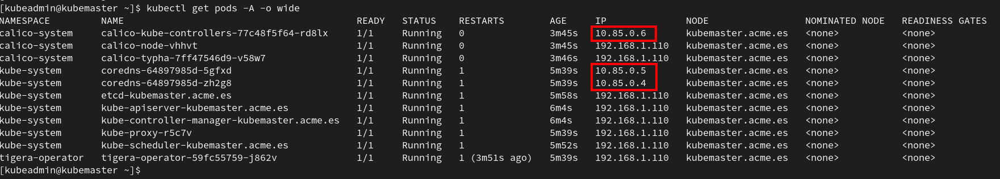

# Instalando Kubernetes

## Creación de las máquinas virtuales

Crear las siguientes máquinas virtuales con una interface de red sobre la misma red todas ellas.

-----------------------------------------------------------------
| Role | Sistema Operativo | vCPUs | Memoria (GiB) | Disco Duro |
|------|-------------------|-------|---------------|------------|
| NFS  | CentOS 8          | 2     | 4             | 1 x 20 GiB (boot) |
| Master | CentOS 8        | 2     | 8             | 1 x 20 GiB (boot) |
| Worker | CentOS 8        | 2     | 4             | 1 x 20 GiB (boot) |
| Worker | CentOS 8        | 2     | 4             | 1 x 20 GiB (boot) |

Suponiendo que la red en la que vamos a desplegarlas es la **192.168.1.0/24** configuramos las máquinas con direccionamiento estático:

---------------
| Nombre | IP |
|------|------|
| nfs.acme.es  | 192.168.1.115/24 |
| kubemaster.acme.es | 192.168.1.110/24 | 
| kubenode1.acme.es | 192.168.1.111/24 | 
| kubenode2.acme.es | 192.168.1.112/24 | 

El fichero de configuración del interface de red **/etc/sysconfig/network-script/ifcfg-enp1s0**:

```
TYPE=Ethernet
PROXY_METHOD=none
BROWSER_ONLY=no
BOOTPROTO=none
DEFROUTE=yes
IPV4_FAILURE_FATAL=no
IPV6INIT=no
IPV6_AUTOCONF=no
IPV6_DEFROUTE=no
IPV6_FAILURE_FATAL=no
IPV6_ADDR_GEN_MODE=stable-privacy
NAME=enp1s0
UUID=7ff72f73-5b87-4685-8dd2-c92fed809bcb
DEVICE=enp1s0
ONBOOT=yes
IPADDR=192.168.1.115
NETMASK=255.255.255.0
GATEWAY=192.168.1.1
DNS1=192.168.1.200
DOMAIN=acme.es
```

>  El nombre del interface de red puede cambiar.

Una vez arrancadas las máquinas, nos aseguramos que estan actualizadas a último nivel ejecutando en cada una de ellas:

```console
[root@host ~]# dnf update -y
```

## Tareas previas de configuración

Estas tareas se tendrán que realizar en todas las VMs del laboratorio:

Tendremos que configurar la sincronización horaria:

```console
[root@host ~]# timedatectl set-timezone Europe/Madrid
[root@host ~]# dnf install chrony -y
...
[root@host ~]# systemctl enable chronyd
[root@host ~]# systemctl start chronyd
[root@host ~]# timedatectl set-ntp true
[root@host ~]#
```

Si SELinux estuviera activado lo desativamos ya que no lo vamos a utilizar con kubernetes:

```console
[root@host ~]# sed -i s/=enforcing/=disabled/g /etc/selinux/config
```

Instalamos los siguientes paquetes:

```console
[root@host ~]# dnf install nfs-utils nfs4-acl-tools wget -y
```

>  Si se ha actualizado el kernel o ha sido necesario desactivar SELinux será necesario reiniciar.

>  Una buena práctica es crear una VM, aplicar estas tareas que se tienen que realizar en todas las máquinas. Dejarla configurada por dhcp y sin configurar el hostname. Una vez terminada la configuración  se hace el [sellado](doc-apoyo/sellado-vm.md) y las máquinas se clonan a partir de este disco. De esta forma estas tareas se hacen solo una vez y no una vez por máquina. Más información [aquí](../doc-apoyo/sellado-vm.md).

## Instalación del servidor NFS

Este servidor lo utilizaremos para ofrecer almacenamiento al cluster de kubernetes.

Instalamos los paquetes de NFS y arrancamos el servicio:

```console
[root@nfs ~]# dnf install nfs-utils net-tools -y
...
[root@nfs ~]# systemctl  enable nfs-server
Created symlink /etc/systemd/system/multi-user.target.wants/nfs-server.service → /usr/lib/systemd/system/nfs-server.service.
[root@nfs ~]# systemctl start nfs-server
[root@nfs ~]# 
```

Lo siguiente será compartir un directorio para exportar por NFS, para ello creamos un directorio:

```console
[root@nfs ~]# mkdir /srv/nfs
[root@nfs ~]#
```

Ahora tendremos que configurar el acceso al share de NFS de tal forma que el fichero **/etc/exports** sea como el que se muestra cambiando las ips por las de nuestros master y workers:

```console
[root@nfs ~]# cat /etc/exports 
# master
/srv/nfs	192.168.1.110(rw,sync) 
# worker01
/srv/nfs	192.168.1.111(rw,sync) 
# worker02
/srv/nfs	192.168.1.112(rw,sync) 
[root@nfs ~]# 
```

>  En este caso el directorio que hemos creado se encontrará en el sistema de ficheros root donde hay 16 GB libres.
>
> ```console
> [root@nfs ~]# df -hP
> Filesystem                  Size  Used Avail Use% Mounted on
> devtmpfs                    1.9G     0  1.9G   0% /dev
> tmpfs                       1.9G     0  1.9G   0% /dev/shm
> tmpfs                       1.9G  8.6M  1.9G   1% /run
> tmpfs                       1.9G     0  1.9G   0% /sys/fs/cgroup
> /dev/mapper/cs-root          17G  1.8G   16G  11% /
> /dev/vda1                  1014M  401M  614M  40% /boot
> tmpfs                       374M     0  374M   0% /run/user/0
> [root@nfs ~]# 
> ```

Releemos el fichero **/etc/exports** para aplicar la nueva configuración:

```console
[root@nfs ~]# exportfs -r
[root@nfs ~]# exportfs -s
/srv/nfs  192.168.1.110(sync,wdelay,hide,no_subtree_check,sec=sys,rw,secure,root_squash,no_all_squash)
/srv/nfs  192.168.1.111(sync,wdelay,hide,no_subtree_check,sec=sys,rw,secure,root_squash,no_all_squash)
/srv/nfs  192.168.1.112(sync,wdelay,hide,no_subtree_check,sec=sys,rw,secure,root_squash,no_all_squash)
[root@nfs ~]# 
```

Por último necesitaremos abrir los puertos del firewall para que el servicio sea accesible:

```console
[root@nfs ~]# firewall-cmd --permanent --add-service=nfs
success
[root@nfs ~]# firewall-cmd --permanent --add-service=rpc-bind
success
[root@nfs ~]# firewall-cmd --permanent --add-service=mountd
success
[root@nfs ~]# firewall-cmd --reload
success
[root@nfs ~]
```

Para verificar que el nodo master y los workers ven el share por nfs podemos ejecutar en cada uno de ellos:

```console
[root@kubemaster ~]# showmount -e 192.168.1.115
Export list for 192.168.1.115:
/srv/nfs 192.168.1.112,192.168.1.111,192.168.1.110
[root@kubemaster ~]# 
```

>  Añadir un disco para datos no es necesario, pero es buena práctica el tener los datos separados del sistema operativo. Si vamos a servir pocos documentos por NFS no sería necesario añadir un disco adicional. Pero en caso contrario se añade un disco adicional, se crea un filesystem y se monta en el directorio que vamos a exportar.

## Tareas comunes a realizar en el nodo master y los workers

Configura resolución DNS si dispones de un servidor DNS. Si no dispones de uno siempre puedes incluir en el fichero **/etc/hosts** las siguientes líneas:

```
192.168.1.110 kubemaster kubemaster.acme.es
192.168.1.111 kubenode1 kubenode1.acme.es
192.168.1.112 kubenode2 kubenode2.acme.es
192.168.1.115 nfs nfs.acme.es
```

Nos aseguramos que firewalld esté activado:

```console
[root@host ~]# systemctl status firewalld
● firewalld.service - firewalld - dynamic firewall daemon
   Loaded: loaded (/usr/lib/systemd/system/firewalld.service; enabled; vendor preset: enabled)
   Active: active (running) since Fri 2021-05-28 18:15:34 CEST; 1min 41s ago
     Docs: man:firewalld(1)
 Main PID: 885 (firewalld)
    Tasks: 2 (limit: 49478)
   Memory: 37.7M
   CGroup: /system.slice/firewalld.service
           └─885 /usr/libexec/platform-python -s /usr/sbin/firewalld --nofork --nopid

May 28 18:15:20 kubemaster.acme.es systemd[1]: Starting firewalld - dynamic firewall daemon...
May 28 18:15:34 kubemaster.acme.es systemd[1]: Started firewalld - dynamic firewall daemon.
[root@host ~]# 
```

Si estuviera desactivado podemos activarlo:

```console
[root@host ~]# systemctl enable firewalld
Created symlink /etc/systemd/system/dbus-org.fedoraproject.FirewallD1.service → /usr/lib/systemd/system/firewalld.service.
Created symlink /etc/systemd/system/multi-user.target.wants/firewalld.service → /usr/lib/systemd/system/firewalld.service. 
[root@host ~]# systemctl start firewalld
[root@host ~]# systemctl status firewalld
● firewalld.service - firewalld - dynamic firewall daemon
   Loaded: loaded (/usr/lib/systemd/system/firewalld.service; enabled; vendor preset: enabled)
   Active: active (running) since Fri 2021-05-28 18:24:19 CEST; 26s ago
     Docs: man:firewalld(1)
 Main PID: 1429 (firewalld)
    Tasks: 2 (limit: 49478)
   Memory: 23.5M
   CGroup: /system.slice/firewalld.service
           └─1429 /usr/libexec/platform-python -s /usr/sbin/firewalld --nofork --nopid

May 28 18:24:19 kubemaster.acme.es systemd[1]: Starting firewalld - dynamic firewall daemon...
May 28 18:24:19 kubemaster.acme.es systemd[1]: Started firewalld - dynamic firewall daemon.
[root@host ~]# 
```

>  Si al ejecutar el status de firewalld nos da el siguiente aviso **WARNING: AllowZoneDrifting is enabled. This is considered an insecure configuration option. It will be removed in a future release.** puedes desactivar **AllowZoneDrifting** en el fichero **/etc/firewalld/firewalld.conf** configurando **AllowZoneDrifting=no**.

Vamos a activar **transparent masquerading** para que los PODs puedan comunicarse dentro del cluster mediante VXLAN:

```console
[root@host ~]# modprobe br_netfilter
[root@host ~]# firewall-cmd --add-masquerade --permanent
success
[root@host ~]# firewall-cmd --reload
success
[root@host ~]# 
```

>  Los Pods se ejecutan dentro de su propia red aislados de la red en la que se encuentran las máquinas, pero es necesario que se puedan comunicar entre ellos. Para ello kubernetes utiliza un protocolo de llamado [VXLAN](https://en.wikipedia.org/wiki/Virtual_Extensible_LAN).

>  Existen otros protocolos para el mismo propósito como son [GRE](https://en.wikipedia.org/wiki/Generic_Routing_Encapsulation) y [Geneve](https://en.wikipedia.org/wiki/Generic_Networking_Virtualization_Encapsulation) que son utilizados por otras tecnologías cloud como Openstack además de utilizar VXLAN también.

Para permitir que kubernetes maneje correctamente el tráfico con el cortafuegos:

```console
[root@host ~]# cat <<EOF > /etc/sysctl.d/k8s.conf
> net.bridge.bridge-nf-call-ip6tables = 1
> net.bridge.bridge-nf-call-iptables  = 1
> net.ipv4.ip_forward                 = 1
> EOF
[root@host ~]# sysctl --system
...
* Applying /etc/sysctl.d/k8s.conf ...
...
[root@host ~]# 
```

Si tenemos activado el swap:

```console
[root@host ~]# free -m
              total        used        free      shared  buff/cache   available
Mem:           7768         168        7407           8         191        7362
Swap:          2047           0        2047
[root@host ~]#
```

Para desactivarla:

```console
[root@host ~]# swapoff  -a
[root@host ~]# free -m
              total        used        free      shared  buff/cache   available
Mem:           7768         167        7409           8         190        7363
Swap:             0           0           0
[root@host ~]# 
```

Ahora es necesario también eliminar la línea del fichero **/etc/fstab** que monta en el arranque el swap:

```console
[root@host ~]# cat /etc/fstab 

#
# /etc/fstab
# Created by anaconda on Sun Oct  4 18:06:49 2020
#
# Accessible filesystems, by reference, are maintained under '/dev/disk/'.
# See man pages fstab(5), findfs(8), mount(8) and/or blkid(8) for more info.
#
# After editing this file, run 'systemctl daemon-reload' to update systemd
# units generated from this file.
#
/dev/mapper/cs-root     /                       xfs     defaults        0 0
UUID=35d72d21-6f35-4e52-ac4d-523a28ac5b5d /boot                   xfs     defaults        0 0
/dev/mapper/cs-swap     none                    swap    defaults        0 0
[root@host ~]# sed -i '/swap/d' /etc/fstab
[root@host ~]# cat /etc/fstab 

#
# /etc/fstab
# Created by anaconda on Sun Oct  4 18:06:49 2020
#
# Accessible filesystems, by reference, are maintained under '/dev/disk/'.
# See man pages fstab(5), findfs(8), mount(8) and/or blkid(8) for more info.
#
# After editing this file, run 'systemctl daemon-reload' to update systemd
# units generated from this file.
#
/dev/mapper/cs-root     /                       xfs     defaults        0 0
UUID=35d72d21-6f35-4e52-ac4d-523a28ac5b5d /boot                   xfs     defaults        0 0
[root@host ~]# 
```

>  Se desactiva para no perder rendimiento al hacer swap, ademas en el espacio de swap se puede volcar información de diferentes entornos que deberían estar aislados y se perdería el aislamiento. [Más información](https://github.com/kubernetes/kubernetes/issues/53533)

>  [Kubernetes ha deprecado docker](https://kubernetes.io/blog/2020/12/02/dont-panic-kubernetes-and-docker/) y desaparecerá en futuras versiones.

Instalamos [CRI-O](https://cri-o.io/) que será el engine para ejecutar contenedores. Configuramos los repositorios:

```console
[root@host ~]# wget -O /etc/yum.repos.d/devel:kubic:libcontainers:stable.repo https://download.opensuse.org/repositories/devel:/kubic:/libcontainers:/stable/CentOS_8_Stream/devel:kubic:libcontainers:stable.repo 
...
[root@host ~]# wget -O /etc/yum.repos.d/devel:kubic:libcontainers:stable:cri-o:1.23:1.23.1.repo https://download.opensuse.org/repositories/devel:kubic:libcontainers:stable:cri-o:1.23:1.23.1/CentOS_8_Stream/devel:kubic:libcontainers:stable:cri-o:1.23:1.23.1.repo
...
[root@host ~]#
```

Configuramos los modulos del kernel necesarios para **CRI-O**:

```console
[root@host ~]#  cat <<EOF > /etc/modules-load.d/crio.conf
> overlay
> br_netfilter
> EOF
[root@host ~]# 
```

Instalamos **CRI-O**. Activamos y arrancamos el servicio:

```console
[root@host ~]# dnf install cri-o -y
---
[root@host ~]# systemctl enable crio
...
[root@host ~]# systemctl start crio
...
[root@host ~]#
```

Configuramos el repositorio de kubernetes:

```console
[root@host ~]# cat <<EOF > /etc/yum.repos.d/kubernetes.repo
> [kubernetes]
> name=Kubernetes
> baseurl=https://packages.cloud.google.com/yum/repos/kubernetes-el7-x86_64
> enabled=1
> gpgcheck=1
> repo_gpgcheck=1
> gpgkey=https://packages.cloud.google.com/yum/doc/yum-key.gpg https://packages.cloud.google.com/yum/doc/rpm-package-key.gpg
> exclude=kubelet kubeadm kubectl
> EOF
[root@host ~]#
```

Instalamos kubernetes:

```console
[root@host ~]# dnf install -y kubelet kubeadm kubectl --disableexcludes=kubernetes
...
[root@host ~]# systemctl enable kubelet
Created symlink /etc/systemd/system/multi-user.target.wants/kubelet.service → /usr/lib/systemd/system/kubelet.service.
[root@host ~]# systemctl start kubelet
[root@host ~]#
```

>  Si queremos instalar una versión especifica de kubernetes podemos ver las versiones disponibles:
>
> ```console
> [root@host ~]# dnf --showduplicates list available kubelet --disableexcludes=kubernetes
> ```
>
> Y para instalar una versión específica:
>
> ```console
> [root@host ~]# dnf install kubelet-1.21.9-0 kubeadm-1.21.9-0 kubectl-1.21.9-0 --disableexcludes=kubernetes -y
> ```

## Configurando kubernetes en el nodo master

Configuramos el firewall para acceder a los servicios de kubernetes:

```console
[root@kubemaster ~]# firewall-cmd --permanent --add-port=6443/tcp
success
[root@kubemaster ~]# firewall-cmd --permanent --add-port=2379-2380/tcp
success
[root@kubemaster ~]# firewall-cmd --permanent --add-port=10250-10252/tcp
success
[root@kubemaster ~]# firewall-cmd --permanent --add-port=10255/tcp
success
[root@kubemaster ~]# firewall-cmd --reload
success
[root@kubemaster ~]# 
```

| Protocol | Direction | Port Range | Purpose | Used by |
|----------|-----------|------------|---------|---------|
| TCP | Inbound  | 6443 | Kubernetes API Server | All |
| TCP | Inbound  | 2379-2380 | etcd server client API | kube-apiserver, etcd |
| TCP | Inbound  | 10250 | Kubelet API | self, Control Plane |
| TCP | Inbound  | 10251 | kube-scheduler | self |
| TCP | Inbound  | 10252 | kube-controller-manager| self |
| TCP | Inbound  | 10255 | Statistics | Master nodes |

>  El puerto 10255 se utiliza para recoger estadísticas y solo debería ser poder accedido por los masters.

Configuramos **kudeadm**:

```console
[root@kubemaster ~]# kubeadm config images pull
[config/images] Pulled k8s.gcr.io/kube-apiserver:v1.23.3
[config/images] Pulled k8s.gcr.io/kube-controller-manager:v1.23.3
[config/images] Pulled k8s.gcr.io/kube-scheduler:v1.23.3
[config/images] Pulled k8s.gcr.io/kube-proxy:v1.23.3
[config/images] Pulled k8s.gcr.io/pause:3.6
[config/images] Pulled k8s.gcr.io/etcd:3.5.1-0
[config/images] Pulled k8s.gcr.io/coredns:1.8.6
[root@kubemaster ~]# 
```
Permitiremos el acceso desde los workers:

```console
[root@kubemaster ~]# firewall-cmd --permanent --add-rich-rule 'rule family=ipv4 source address=192.168.1.111/32 accept'
success
[root@kubemaster ~]# firewall-cmd --permanent --add-rich-rule 'rule family=ipv4 source address=192.168.1.112/32 accept'
success
[root@kubemaster ~]# firewall-cmd --reload
success
[root@kubemaster ~]
```

>  Esto no es una buena práctica. En un entorno en producción deberíamos permitir únicamente el tráfico necesario y no todo el tráfico entre el master y los workers.

Instalamos el plugin CNI (Container Network Interface) de kubernetes y definimos la red de los PODs:

```console
[root@kubemaster ~]# kubeadm init --pod-network-cidr 192.169.0.0/16
[init] Using Kubernetes version: v1.20.2
[preflight] Running pre-flight checks
...
[kubelet-finalize] Updating "/etc/kubernetes/kubelet.conf" to point to a rotatable kubelet client certificate and key
[addons] Applied essential addon: CoreDNS
[addons] Applied essential addon: kube-proxy

Your Kubernetes control-plane has initialized successfully!

To start using your cluster, you need to run the following as a regular user:

  mkdir -p $HOME/.kube
  sudo cp -i /etc/kubernetes/admin.conf $HOME/.kube/config
  sudo chown $(id -u):$(id -g) $HOME/.kube/config

Alternatively, if you are the root user, you can run:

  export KUBECONFIG=/etc/kubernetes/admin.conf

You should now deploy a pod network to the cluster.
Run "kubectl apply -f [podnetwork].yaml" with one of the options listed at:
  https://kubernetes.io/docs/concepts/cluster-administration/addons/

Then you can join any number of worker nodes by running the following on each as root:

kubeadm join 192.168.1.110:6443 --token gmk4le.8gsfpknu99k78qut \
    --discovery-token-ca-cert-hash sha256:d2cd35c9ab95f4061aa9d9b993f7e8742b2307516a3632b27ea10b64baf8cd71 
[root@kubemaster ~]# 
```

>  Guarda el comando kubeadm ya que lo necesitarás para unir los workers al clúster.

>  Si automatizas el despliegue de kubernetes con ansible necesitarás guardar la salida del último comando para poder añadir workers al cluster. Como en la ejecución de ansible no se ve la salida del comando podemos almacenar la salida del comando en una variable y mostrarla. En [01-playbooks.md](../labs-ansible/01-playbooks.md) se puede ver un ejemplo de un playbook que almacena la salida de un comando en una variable y luego se imprime en la salida estándar el valor de dicha variable.

>  Es muy importante que la red que utilicemos para los PODs tenga IPs suficientes para el número de contenedores que queramos arrancar y no debe tener solapamiento con las redes ya existentes.

En este caso la red que hemos configurado para los pods es de Clase C con una cantidad total de IPs de **65.536**.

>  [Installing a POD network](https://kubernetes.io/docs/setup/production-environment/tools/kubeadm/create-cluster-kubeadm/#pod-network)

Para que el usuario **root** pueda utilizar **kubectl** para operar el cluster bastaría con ejecutar:

```console
[root@kubemaster ~]# export KUBECONFIG=/etc/kubernetes/admin.conf
```

Vamos a autorizar al usuario **root** acceder al cluster para terminar la configuración de la forma habitual con la que lo haremos para el resto de usuarios:

```console
[root@kubemaster ~]# mkdir -p /root/.kube
[root@kubemaster ~]# cp -i /etc/kubernetes/admin.conf /root/.kube/config
[root@kubemaster ~]# chown $(id -u):$(id -g) /root/.kube/config
[root@kubemaster ~]# kubectl get nodes
NAME             STATUS     ROLES                  AGE     VERSION
kubemaster.acme.es   NotReady   control-plane,master   9m49s   v1.20.2
[root@kubemaster ~]# 
```

Vemos que se muestra como **NotReady**. Eso es debido a que no hemos desplegado la red para los PODs todavía.

## Instalando la SDN

Ahora es necesario instalar una SDN para que los pods puedan comunicarse. Se proporcionan dos métodos:

+ Instalación de [Calico](00-01-sdn-calico.md).
+ Instalación de [SDN en Azure](00-02-sdn-azure.md).

Después de desplegar la SDN veremos algo como esto:



Si nos fijamos aunque hemos inicializado la red de pods como **192.169.1.0/16** no vemos direccionamientos de estas redes. Sin embargo, vemos direccionamientos **10.85.0.X**. Este direccionamiento es asignado a los pods por el engine de contenedores, en este caso **CRI-O**, y los PODs en cuestión ya tienen direccionamiento asignado antes de desplegar la SDN. Llegados a este caso deberemos reiniciar el master para que las IPs a los pods las asigne la SDN que hemos desplegado:


## Desplegando un ingress controller

Para poder acceder a los PODs desde fuera de kubernetes necesitaremos instalar un ingress controller. Para ello en el master:

```console
[root@kubemaster ~]# kubectl apply -f https://raw.githubusercontent.com/haproxytech/kubernetes-ingress/master/deploy/haproxy-ingress.yaml
namespace/haproxy-controller created
serviceaccount/haproxy-kubernetes-ingress created
clusterrole.rbac.authorization.k8s.io/haproxy-kubernetes-ingress created
clusterrolebinding.rbac.authorization.k8s.io/haproxy-kubernetes-ingress created
configmap/haproxy-kubernetes-ingress created
deployment.apps/haproxy-kubernetes-ingress-default-backend created
service/haproxy-kubernetes-ingress-default-backend created
deployment.apps/haproxy-kubernetes-ingress created
service/haproxy-kubernetes-ingress created
[root@kubemaster ~]#
```

>  Existen diferentes ingress controller que se pueden desplegar e incluso podemos desplegar varios que convivan en kubernetes. En este caso será necesario utilizar [annotations](https://kubernetes.io/docs/concepts/overview/working-with-objects/annotations/) para especificar que ingress controller se deberá utilizar en cada deployment.

Se crea un namespace para el ingress controller:

```console
[root@kubemaster ~]# kubectl get namespaces
NAME                 STATUS   AGE
calico-system        Active   53m
default              Active   55m
haproxy-controller   Active   26m
kube-node-lease      Active   56m
kube-public          Active   56m
kube-system          Active   56m
tigera-operator      Active   55m
[root@kubemaster ~]# kubectl get pods --namespace=haproxy-controller
NAME                                                          READY   STATUS    RESTARTS   AGE
haproxy-kubernetes-ingress-54f9b477b9-tnq4r                   1/1     Running   0          27m
haproxy-kubernetes-ingress-default-backend-6b7ddb86b9-qztwc   1/1     Running   0          27m
[root@kubemaster ~]#  
```

Vemos los servicios:

```console
[root@kubemaster ~]# kubectl get svc -A
NAMESPACE            NAME                                         TYPE        CLUSTER-IP       EXTERNAL-IP   PORT(S)                                     AGE
calico-system        calico-kube-controllers-metrics              ClusterIP   10.110.61.65     <none>        9094/TCP                                    54m
calico-system        calico-typha                                 ClusterIP   10.106.50.61     <none>        5473/TCP                                    54m
default              kubernetes                                   ClusterIP   10.96.0.1        <none>        443/TCP                                     56m
haproxy-controller   haproxy-kubernetes-ingress                   NodePort    10.104.187.186   <none>        80:31826/TCP,443:30886/TCP,1024:31734/TCP   27m
haproxy-controller   haproxy-kubernetes-ingress-default-backend   ClusterIP   10.103.195.4     <none>        8080/TCP                                    27m
kube-system          kube-dns                                     ClusterIP   10.96.0.10       <none>        53/UDP,53/TCP,9153/TCP                      56m
[root@kubemaster ~]# 
```

Según lo anterior tenemos:

+ El puerto del host **31826** se encuentra mapeado al **80** de los contenedores.
+ El puerto del host **30886** se encuentra mapeado al **443** de los contenedores.
+ El puerto del host **31734** se encuentra mapeado al **1024** de los contenedores. Este puerto se utiliza para estadísticas de haproxy.

>  [Ingress Controller](https://kubernetes.io/docs/concepts/services-networking/ingress-controllers/) 

>  [HAproxy ingress controller](https://github.com/haproxytech/kubernetes-ingress#readme)

## Configurando los workers

Lo primero que tenemos que hacer en los workers es abrir los puertos:

```console
[root@kubenodeX ~]# firewall-cmd --zone=public --permanent --add-port={10250,30000-32767}/tcp
success
[root@kubenodeX ~]# firewall-cmd --reload
success
[root@kubenodeX ~]#
```

Ahora para unirse al clúster tendremos que ejecutar en los nodos el comando de **kubeadm** que nos produjo la ejecución de **kubadmin init**:

```console
[root@kubenodeX ~]# kubeadm join 192.168.1.110:6443 --token gmk4le.8gsfpknu99k78qut --discovery-token-ca-cert-hash sha256:d2cd35c9ab95f4061aa9d9b993f7e8742b2307516a3632b27ea10b64baf8cd71  
...

This node has joined the cluster:
* Certificate signing request was sent to apiserver and a response was received.
* The Kubelet was informed of the new secure connection details.

Run 'kubectl get nodes' on the control-plane to see this node join the cluster.

[root@kubenodeX ~]# 
```

>  Si tenemos un clúster ya desplegado y queremos añadir un nuevo nodo deberemos seguir el siguiente [procedimiento](00-03-añadiendo-nodos.md).

Puede llevar unos minutos que los workers aparezcan como **Ready**:

```console
[root@kubemaster ~]# kubectl get nodes-o wide
NAME                 STATUS   ROLES                  AGE   VERSION   INTERNAL-IP     EXTERNAL-IP   OS-IMAGE          KERNEL-VERSION          CONTAINER-RUNTIME
kubemaster.acme.es   Ready    control-plane,master   58m   v1.23.3   192.168.1.110   <none>        CentOS Stream 8   4.18.0-365.el8.x86_64   cri-o://1.23.1
kubenode1.acme.es    Ready    <none>                 43m   v1.23.3   192.168.1.111   <none>        CentOS Stream 8   4.18.0-365.el8.x86_64   cri-o://1.23.1
kubenode2.acme.es    Ready    <none>                 43m   v1.23.3   192.168.1.112   <none>        CentOS Stream 8   4.18.0-365.el8.x86_64   cri-o://1.23.1
[root@kubemaster ~]# kubectl get pods -A -o wide
NAMESPACE            NAME                                                          READY   STATUS    RESTARTS   AGE   IP              NODE                 NOMINATED NODE   READINESS GATES
calico-system        calico-kube-controllers-77c48f5f64-rd8lx                      1/1     Running   1          57m   192.169.200.3   kubemaster.acme.es   <none>           <none>
calico-system        calico-node-8ktvr                                             1/1     Running   0          44m   192.168.1.112   kubenode2.acme.es    <none>           <none>
calico-system        calico-node-vhhvt                                             1/1     Running   1          57m   192.168.1.110   kubemaster.acme.es   <none>           <none>
calico-system        calico-node-vksb2                                             1/1     Running   0          44m   192.168.1.111   kubenode1.acme.es    <none>           <none>
calico-system        calico-typha-7ff47546d9-c8pf6                                 1/1     Running   0          44m   192.168.1.111   kubenode1.acme.es    <none>           <none>
calico-system        calico-typha-7ff47546d9-v58w7                                 1/1     Running   1          57m   192.168.1.110   kubemaster.acme.es   <none>           <none>
haproxy-controller   haproxy-kubernetes-ingress-54f9b477b9-tnq4r                   1/1     Running   0          30m   192.169.49.66   kubenode2.acme.es    <none>           <none>
haproxy-controller   haproxy-kubernetes-ingress-default-backend-6b7ddb86b9-qztwc   1/1     Running   0          30m   192.169.49.65   kubenode2.acme.es    <none>           <none>
kube-system          coredns-64897985d-5gfxd                                       1/1     Running   2          59m   192.169.200.2   kubemaster.acme.es   <none>           <none>
kube-system          coredns-64897985d-zh2g8                                       1/1     Running   2          59m   192.169.200.1   kubemaster.acme.es   <none>           <none>
kube-system          etcd-kubemaster.acme.es                                       1/1     Running   2          59m   192.168.1.110   kubemaster.acme.es   <none>           <none>
kube-system          kube-apiserver-kubemaster.acme.es                             1/1     Running   2          59m   192.168.1.110   kubemaster.acme.es   <none>           <none>
kube-system          kube-controller-manager-kubemaster.acme.es                    1/1     Running   2          59m   192.168.1.110   kubemaster.acme.es   <none>           <none>
kube-system          kube-proxy-cn7zk                                              1/1     Running   0          44m   192.168.1.111   kubenode1.acme.es    <none>           <none>
kube-system          kube-proxy-mpwzs                                              1/1     Running   0          44m   192.168.1.112   kubenode2.acme.es    <none>           <none>
kube-system          kube-proxy-r5c7v                                              1/1     Running   2          59m   192.168.1.110   kubemaster.acme.es   <none>           <none>
kube-system          kube-scheduler-kubemaster.acme.es                             1/1     Running   2          59m   192.168.1.110   kubemaster.acme.es   <none>           <none>
tigera-operator      tigera-operator-59fc55759-j862v                               1/1     Running   2          59m   192.168.1.110   kubemaster.acme.es   <none>           <none>
[root@kubemaster ~]# 
```

En los workers:

```console
[root@kubenode1 ~]# ip a
1: lo: <LOOPBACK,UP,LOWER_UP> mtu 65536 qdisc noqueue state UNKNOWN group default qlen 1000
    link/loopback 00:00:00:00:00:00 brd 00:00:00:00:00:00
    inet 127.0.0.1/8 scope host lo
       valid_lft forever preferred_lft forever
    inet6 ::1/128 scope host 
       valid_lft forever preferred_lft forever
2: enp1s0: <BROADCAST,MULTICAST,UP,LOWER_UP> mtu 1500 qdisc fq_codel state UP group default qlen 1000
    link/ether 52:54:00:ac:c3:d0 brd ff:ff:ff:ff:ff:ff
    inet 192.168.1.111/24 brd 192.168.1.255 scope global noprefixroute enp1s0
       valid_lft forever preferred_lft forever
    inet6 fe80::bd39:5246:9744:9c2d/64 scope link noprefixroute 
       valid_lft forever preferred_lft forever
5: vxlan.calico: <BROADCAST,MULTICAST,UP,LOWER_UP> mtu 1450 qdisc noqueue state UNKNOWN group default 
    link/ether 66:3f:e9:38:75:2e brd ff:ff:ff:ff:ff:ff
    inet 192.169.232.0/32 scope global vxlan.calico
       valid_lft forever preferred_lft forever
    inet6 fe80::643f:e9ff:fe38:752e/64 scope link 
       valid_lft forever preferred_lft forever
[root@kubenode1 ~]# 
```

```console
[root@kubenode2 ~]# ip a
1: lo: <LOOPBACK,UP,LOWER_UP> mtu 65536 qdisc noqueue state UNKNOWN group default qlen 1000
    link/loopback 00:00:00:00:00:00 brd 00:00:00:00:00:00
    inet 127.0.0.1/8 scope host lo
       valid_lft forever preferred_lft forever
    inet6 ::1/128 scope host 
       valid_lft forever preferred_lft forever
2: enp1s0: <BROADCAST,MULTICAST,UP,LOWER_UP> mtu 1500 qdisc fq_codel state UP group default qlen 1000
    link/ether 52:54:00:22:a7:d5 brd ff:ff:ff:ff:ff:ff
    inet 192.168.1.112/24 brd 192.168.1.255 scope global noprefixroute enp1s0
       valid_lft forever preferred_lft forever
    inet6 fe80::672e:9d57:21bb:7b5a/64 scope link noprefixroute 
       valid_lft forever preferred_lft forever
5: vxlan.calico: <BROADCAST,MULTICAST,UP,LOWER_UP> mtu 1450 qdisc noqueue state UNKNOWN group default 
    link/ether 66:e1:e7:74:ad:c7 brd ff:ff:ff:ff:ff:ff
    inet 192.169.49.64/32 scope global vxlan.calico
       valid_lft forever preferred_lft forever
    inet6 fe80::64e1:e7ff:fe74:adc7/64 scope link 
       valid_lft forever preferred_lft forever
6: calid0f47462bc7@if3: <BROADCAST,MULTICAST,UP,LOWER_UP> mtu 1450 qdisc noqueue state UP group default 
    link/ether ee:ee:ee:ee:ee:ee brd ff:ff:ff:ff:ff:ff link-netns 5e591044-697b-4189-ab3d-52ac7a58fed8
    inet6 fe80::ecee:eeff:feee:eeee/64 scope link 
       valid_lft forever preferred_lft forever
7: calid373a0371b6@if3: <BROADCAST,MULTICAST,UP,LOWER_UP> mtu 1450 qdisc noqueue state UP group default 
    link/ether ee:ee:ee:ee:ee:ee brd ff:ff:ff:ff:ff:ff link-netns ec57f39f-767e-4e89-be48-d5646ac36202
    inet6 fe80::ecee:eeff:feee:eeee/64 scope link 
       valid_lft forever preferred_lft forever
[root@kubenode2 ~]# 
```

En el nodo2 hacemos ping a la ip configurada en el interface **vxlan.calico** del nodo 1:

```console
[root@kubenode2 ~]# ping -c 4 192.169.232.0
PING 192.169.232.0 (192.169.232.0) 56(84) bytes of data.
64 bytes from 192.169.232.0: icmp_seq=1 ttl=64 time=0.548 ms
64 bytes from 192.169.232.0: icmp_seq=2 ttl=64 time=0.628 ms
64 bytes from 192.169.232.0: icmp_seq=3 ttl=64 time=0.587 ms
64 bytes from 192.169.232.0: icmp_seq=4 ttl=64 time=0.489 ms

--- 192.169.232.0 ping statistics ---
4 packets transmitted, 4 received, 0% packet loss, time 3107ms
rtt min/avg/max/mdev = 0.489/0.563/0.628/0.051 ms
[root@kubenode2 ~]# 
```

>  Probar la conectividad desdel nodo 1 al nodo 2.

## Creamos un usuario no administrador

Creamos un usuario no administrador para la gestión del clúster:

```console
[root@kubemaster ~]# useradd -md /home/kubeadmin kubeadmin
[root@kubemaster ~]# passwd kubeadmin
Changing password for user kubeadmin.
New password: 
BAD PASSWORD: The password is shorter than 8 characters
Retype new password: 
passwd: all authentication tokens updated successfully.
[root@kubemaster ~]# mkdir -p /home/kubeadmin/.kube
[root@kubemaster ~]# cp -i /etc/kubernetes/admin.conf /home/kubeadmin/.kube/config
[root@kubemaster ~]# chown kubeadmin. /home/kubeadmin/.kube/config
[root@kubemaster ~]# cat <<EOF > /etc/sudoers.d/kubeadmin
> ALL            ALL = (ALL) NOPASSWD: ALL
> EOF
[root@kubemaster ~]# 
```