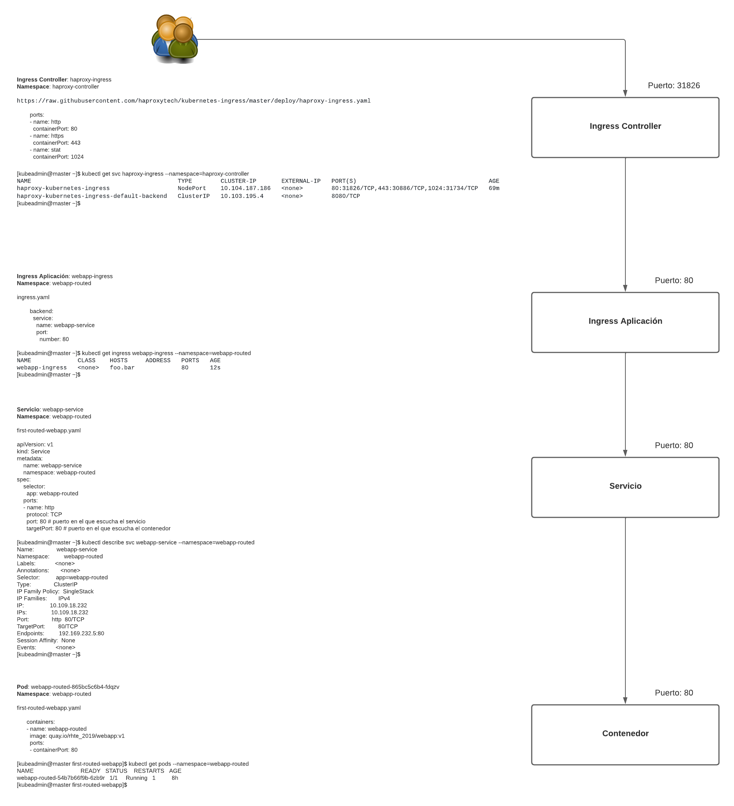

# Desplegando la primera aplicación accesible desde el exterior

## Definimos el deployment para la aplicación

Junto con el deployment definimos un servicio en el fichero [first-routed-webapp.yaml](first-routed-webapp/first-routed-webapp.yaml):

```yaml
apiVersion: apps/v1
kind: Deployment
metadata:
  name: webapp-routed
  namespace: webapp-routed
  labels:
    app: webapp-routed
spec:
  replicas: 1
  selector:
    matchLabels:
      app: webapp-routed
  template:
    metadata:
      labels:
        app: webapp-routed
    spec:
      containers:
      - name: webapp-routed
        image: quay.io/rhte_2019/webapp:v1
        ports:
        - containerPort: 80
        readinessProbe:
          httpGet:
            path: /
            port: 80
          initialDelaySeconds: 5
          periodSeconds: 5
          successThreshold: 1
---
apiVersion: v1
kind: Service
metadata:
    name: webapp-service
    namespace: webapp-routed
spec:
    selector:
      app: webapp-routed
    ports:
    - name: http
      protocol: TCP
      port: 80 # puerto en el que escucha el servicio
      targetPort: 80 # puerto en el que escucha el contenedor
```

## Desplegamos la aplicación

Creamos un namespace y desplegamos la aplicación:

```console
[kubeadmin@master first-routed-app]$ kubectl create namespace webapp-routed
namespace/webapp-routed created
[kubeadmin@master first-routed-app]$ kubectl apply -f first-routed-webapp.yaml
deployment.apps/webapp-routed created
service/webapp-service created
[kubeadmin@master first-routed-app]$ kubectl get pods --namespace=webapp-routed -o wide
NAME                             READY   STATUS    RESTARTS   AGE   IP               NODE               NOMINATED NODE   READINESS GATES
webapp-routed-865bc5c6b4-fdqzv   0/1     Running   0          9s    192.169.112.7   worker01.acme.es   <none>           <none>
[kubeadmin@master first-routed-app]$ kubectl get svc --namespace=webapp-routed -o wide
NAME             TYPE        CLUSTER-IP     EXTERNAL-IP   PORT(S)   AGE     SELECTOR
webapp-service   ClusterIP   10.100.141.193   <none>        80/TCP    22s   app=webapp-routed
[kubeadmin@master first-routed-app]$ kubectl describe svc webapp-service --namespace=webapp-routed
Name:              webapp-service
Namespace:         webapp-routed
Labels:            <none>
Annotations:       <none>
Selector:          app=webapp-routed
Type:              ClusterIP
IP Families:       <none>
IP:                10.100.141.193
IPs:               10.100.141.193
Port:              http  80/TCP
TargetPort:        80/TCP
Endpoints:         192.169.112.7:80
Session Affinity:  None
Events:            <none>
[kubeadmin@master first-routed-app]$ 
```

## Creamos el ingress

Creamos el fichero [ingress.yaml](first-routed-webapp/ingress.yaml):

```yaml
---
apiVersion: networking.k8s.io/v1
kind: Ingress
metadata:
  name: webapp-ingress
  namespace: webapp-routed
  labels:
    app: webapp-routed
  annotations:
      haproxy.org/path-rewrite: "/"
spec:
  rules:
  - host: foo.bar
    http:
      paths:
      - path: /webapp
        pathType: "Prefix"
        backend:
          service:
            name: webapp-service
            port:
              number: 80
```

Desplegamos el ingress:

```console
[kubeadmin@master first-routed-app]$ kubectl apply -f ingress.yaml
ingress.networking.k8s.io/webapp-ingress created
[kubeadmin@master first-routed-app]$ kubectl get ingress --namespace=webapp-routed
NAME             CLASS    HOSTS   ADDRESS   PORTS   AGE
webapp-ingress   <none>   foo.bar             80      7s
[kubeadmin@master first-routed-app]$ kubectl describe ingress webapp-ingress --namespace=webapp-routed
Name:             webapp-ingress
Namespace:        webapp-routed
Address:          
Default backend:  default-http-backend:80 (<error: endpoints "default-http-backend" not found>)
Rules:
  Host        Path  Backends
  ----        ----  --------
  foo.bar     
              /webapp   webapp-service:80 (192.169.112.7:80)
Annotations:  haproxy.org/path-rewrite: /
Events:       <none>

[kubeadmin@master first-routed-app]$
```

Comprobamos el endpoint:

```console
[kubeadmin@master first-routed-app]$ kubectl get ep --namespace=webapp-routed
NAME             ENDPOINTS           AGE
webapp-service   192.169.112.7:80   16m
[kubeadmin@master first-routed-app]$ kubectl describe ep webapp-service --namespace=webapp-routed
Name:         webapp-service
Namespace:    webapp-routed
Labels:       <none>
Annotations:  endpoints.kubernetes.io/last-change-trigger-time: 2021-01-25T06:41:00Z
Subsets:
  Addresses:          192.169.112.7
  NotReadyAddresses:  <none>
  Ports:
    Name  Port  Protocol
    ----  ----  --------
    http  80    TCP

Events:  <none>
[kubeadmin@master first-routed-app]$ 
```

Definimos un ConfigMap en el fichero [configmap.yaml](first-routed-webapp/configmap.yaml):

```yaml
apiVersion: v1
kind: ConfigMap
metadata:
  name: haproxy-configmap
  namespace: webapp-routed
data:
  servers-increment: "42"
  ssl-redirect: "OFF"
```

```console
[kubeadmin@master first-routed-app]$ kubectl apply -f configmap.yaml 
configmap/haproxy-configmap created
[kubeadmin@master first-routed-app]$ 
```

Aunque apenas hemos incluido configuración en este ConfigMap podemos incluir [configuración](https://github.com/haproxytech/kubernetes-ingress/tree/master/documentation) adicional, como configuración de certificados si utilizamos TLS, ...

Comprobamos que es accesible desde fuera:

```console
[kubeadmin@master first-routed-webapp]$ kubectl get svc --namespace=haproxy-controller
NAME                      TYPE        CLUSTER-IP       EXTERNAL-IP   PORT(S)                                     AGE
haproxy-ingress           NodePort    10.103.225.131   <none>        80:30432/TCP,443:31967/TCP,1024:31588/TCP   58m
ingress-default-backend   ClusterIP   10.96.170.15     <none>        8080/TCP                                    58m
[kubeadmin@master first-routed-webapp]$ 
```

Tenemos que el puerto **30432** del master se encuentra mapeado al **80** de los contenedores, luego si desde una máquina que no sea el master hacemos:

```console
[jadebustos@archimedes ~]$ curl -I -H 'Host: foo.bar' 'http://192.168.1.110:30432/webapp'
HTTP/1.1 200 OK
date: Mon, 25 Jan 2021 07:11:50 GMT
server: Apache/2.4.38 (Debian)
x-powered-by: PHP/7.4.14
content-type: text/html; charset=UTF-8

[jadebustos@archimedes ~]$
```

Como obtenemos un código **HTTP/1.1 200 OK** ya estaría accesible desde el exterior.

Si hacemos resolver **foo.bar** a la dirección ip del mater **192.168.1.110** podremos acceder a nuestra aplicación accediendo a **http://<span></span>foo.bar:30432/webapp**.

>  [Service](https://kubernetes.io/docs/concepts/services-networking/service/)

>  [HAproxy Ingress](https://www.haproxy.com/documentation/kubernetes/latest/)

>  [Dissecting the haproxy kubernetes ingress controller](https://www.haproxy.com/blog/dissecting-the-haproxy-kubernetes-ingress-controller/)

## Como funciona el Ingress

El ingress controller se encarga de enrutar el tráfico, nos conectamos al ingress controller:

```console
[kubeadmin@master ~]$ kubectl get pods -A -o wide | grep haproxy
haproxy-controller     haproxy-ingress-67f7c8b555-j7qdp             1/1     Running   1          6h8m    192.169.22.2     worker02.acme.es   <none>           <none>
haproxy-controller     ingress-default-backend-78f5cc7d4c-jzfk8     1/1     Running   1          6h8m    192.169.112.11   worker01.acme.es   <none>           <none>
[kubeadmin@master ~]$ kubectl exec --stdin --tty haproxy-ingress-67f7c8b555-j7qdp --namespace=haproxy-controller -- /bin/sh
/ $ 
```

Veamos la configuración del **haproxy**:

```console
/ $ cd /etc/haproxy/
/etc/haproxy $ ls -lh
total 12K    
drwxr-xr-x    5 haproxy  haproxy       47 Jan 25 09:14 certs
drwxr-xr-x    2 haproxy  haproxy        6 Jan 25 09:14 errors
-rw-r--r--    1 haproxy  haproxy    10.5K Jan 25 09:40 haproxy.cfg
drwxr-xr-x    2 haproxy  haproxy       82 Jan 25 09:14 maps
drwxr-xr-x    2 haproxy  haproxy        6 Jan 25 09:40 transactions
/etc/haproxy $ 
```

Dentro del fichero **haproxy.cfg** tendremos la siguiente configuración:

```
backend webapp-routed-webapp-service-80 
  mode http
  balance roundrobin
  option forwardfor
  server SRV_1 192.169.112.10:80 check weight 128
  server SRV_2 127.0.0.1:80 disabled check weight 128
...
  server SRV_40 127.0.0.1:80 disabled check weight 128
  server SRV_41 127.0.0.1:80 disabled check weight 128
  server SRV_42 127.0.0.1:80 disabled check weight 128
```

Esta redireccionando las peticiones hacía la dirección del endpoint definido en el ingress que creamos para la aplicación:

```console
[kubeadmin@master ~]$ kubectl get ep webapp-service --namespace=webapp-routed
NAME             ENDPOINTS           AGE
webapp-service   192.169.112.10:80   5h22m
[kubeadmin@master ~]$ kubectl describe ep webapp-service --namespace=webapp-routed
Name:         webapp-service
Namespace:    webapp-routed
Labels:       <none>
Annotations:  endpoints.kubernetes.io/last-change-trigger-time: 2021-01-25T09:13:42Z
Subsets:
  Addresses:          192.169.112.10
  NotReadyAddresses:  <none>
  Ports:
    Name  Port  Protocol
    ----  ----  --------
    http  80    TCP

Events:  <none>
[kubeadmin@master ~]$  
```


