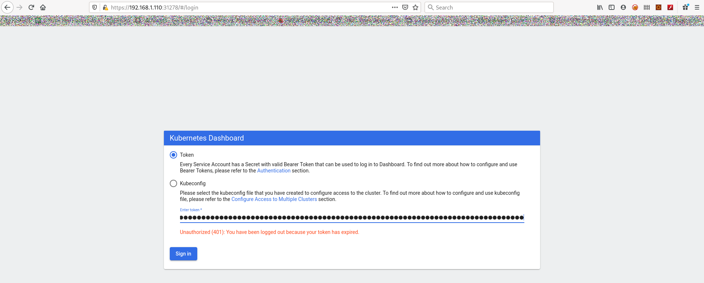
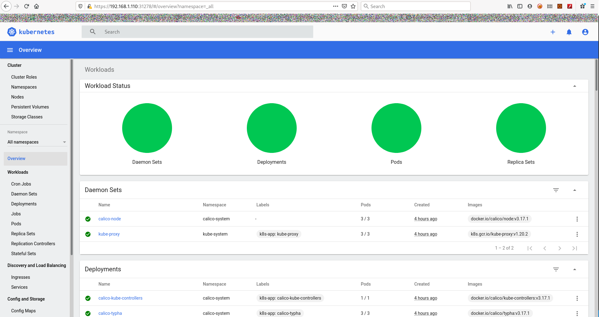

# Instalando un dashboard


Desplegamos el dashboard:

```console
[kubeadmin@master ~]$ kubectl apply -f https://raw.githubusercontent.com/kubernetes/dashboard/v2.0.0/aio/deploy/recommended.yaml
namespace/kubernetes-dashboard created
serviceaccount/kubernetes-dashboard created
service/kubernetes-dashboard created
secret/kubernetes-dashboard-certs created
secret/kubernetes-dashboard-csrf created
secret/kubernetes-dashboard-key-holder created
configmap/kubernetes-dashboard-settings created
role.rbac.authorization.k8s.io/kubernetes-dashboard created
clusterrole.rbac.authorization.k8s.io/kubernetes-dashboard created
rolebinding.rbac.authorization.k8s.io/kubernetes-dashboard created
clusterrolebinding.rbac.authorization.k8s.io/kubernetes-dashboard created
deployment.apps/kubernetes-dashboard created
service/dashboard-metrics-scraper created
deployment.apps/dashboard-metrics-scraper created
[kubeadmin@master ~]$ 
```

Por defecto solo podremos conectarnos desde el master al dashboard. Para poder acceder desde cualquier editaremos el servicio creado por el dashboard:

```console
[kubeadmin@master ~]$ kubectl get svc -A
NAMESPACE              NAME                        TYPE        CLUSTER-IP       EXTERNAL-IP   PORT(S)                                     AGE
calico-system          calico-typha                ClusterIP   10.111.29.122    <none>        5473/TCP                                    4h10m
default                kubernetes                  ClusterIP   10.96.0.1        <none>        443/TCP                                     4h23m
haproxy-controller     haproxy-ingress             NodePort    10.103.225.131   <none>        80:30432/TCP,443:31967/TCP,1024:31588/TCP   3h32m
haproxy-controller     ingress-default-backend     ClusterIP   10.96.170.15     <none>        8080/TCP                                    3h33m
kube-system            kube-dns                    ClusterIP   10.96.0.10       <none>        53/UDP,53/TCP,9153/TCP                      4h23m
kubernetes-dashboard   dashboard-metrics-scraper   ClusterIP   10.97.179.137    <none>        8000/TCP                                    11m
kubernetes-dashboard   kubernetes-dashboard        ClusterIP   10.100.128.232   <none>        443/TCP                                     11m
webapp-routed          webapp-service              ClusterIP   10.100.141.193   <none>        80/TCP                                      172m
webapp-volumes         volumes-service             ClusterIP   10.103.11.121    <none>        80/TCP                                      73m
[kubeadmin@master ~]$ kubectl edit service kubernetes-dashboard --namespace=kubernetes-dashboard
```
Y cambiamos **spec.type** de **ClusterIP** a **NodePort**:

```yaml
spec:
  clusterIP: 10.100.128.232
  clusterIPs:
  - 10.100.128.232
  ports:
  - port: 443
    protocol: TCP
    targetPort: 8443
  selector:
    k8s-app: kubernetes-dashboard
  sessionAffinity: None
  type: NodePort
status:
  loadBalancer: {}
```

Guardamos y salimos:

```console
[kubeadmin@master ~]$ kubectl get svc -A
NAMESPACE              NAME                        TYPE        CLUSTER-IP       EXTERNAL-IP   PORT(S)                                     AGE
calico-system          calico-typha                ClusterIP   10.111.29.122    <none>        5473/TCP                                    4h11m
default                kubernetes                  ClusterIP   10.96.0.1        <none>        443/TCP                                     4h25m
haproxy-controller     haproxy-ingress             NodePort    10.103.225.131   <none>        80:30432/TCP,443:31967/TCP,1024:31588/TCP   3h34m
haproxy-controller     ingress-default-backend     ClusterIP   10.96.170.15     <none>        8080/TCP                                    3h34m
kube-system            kube-dns                    ClusterIP   10.96.0.10       <none>        53/UDP,53/TCP,9153/TCP                      4h25m
kubernetes-dashboard   dashboard-metrics-scraper   ClusterIP   10.97.179.137    <none>        8000/TCP                                    12m
kubernetes-dashboard   kubernetes-dashboard        NodePort    10.100.128.232   <none>        443:31278/TCP                               12m
webapp-routed          webapp-service              ClusterIP   10.100.141.193   <none>        80/TCP                                      173m
webapp-volumes         volumes-service             ClusterIP   10.103.11.121    <none>        80/TCP                                      75m
[kubeadmin@master ~]$ 
```

Ahora que ya es accesible por red creamos un [usuario](https://github.com/kubernetes/dashboard/blob/master/docs/user/access-control/creating-sample-user.md).

Para acceder necesitamos un token:

```console
[kubeadmin@master ~]$ kubectl -n kubernetes-dashboard get secret $(kubectl -n kubernetes-dashboard get sa/admin-user -o jsonpath="{.secrets[0].name}") -o go-template="{{.data.token | base64decode}}"
eyJhbGciOiJSUzI1NiIsImtpZCI6IndSdjVWWjh1dlUteWlzYzZ3N1Z0NHRKMV9Kc3FTSnRPbUxadW1Sc1cyYmcifQ.eyJpc3MiOiJrdWJlcm5ldGVzL3NlcnZpY2VhY2NvdW50Iiwia3ViZXJuZXRlcy5pby9zZXJ2aWNlYWNjb3VudC9uYW1lc3BhY2UiOiJrdWJlcm5ldGVzLWRhc2hib2FyZCIsImt1YmVybmV0ZXMuaW8vc2VydmljZWFjY291bnQvc2VjcmV0Lm5hbWUiOiJhZG1pbi11c2VyLXRva2VuLXI4Zmt6Iiwia3ViZXJuZXRlcy5pby9zZXJ2aWNlYWNjb3VudC9zZXJ2aWNlLWFjY291bnQubmFtZSI6ImFkbWluLXVzZXIiLCJrdWJlcm5ldGVzLmlvL3NlcnZpY2VhY2NvdW50L3NlcnZpY2UtYWNjb3VudC51aWQiOiJlNDU2ZjE4My01OGQxLTQ0NGUtYjJkOS1mMWRkMjM0MmQxMzMiLCJzdWIiOiJzeXN0ZW06c2VydmljZWFjY291bnQ6a3ViZXJuZXRlcy1kYXNoYm9hcmQ6YWRtaW4tdXNlciJ9.layvT-iZh4tfK1L-pKuJ1cOjX5MuxR4llP9a2_y_ALvB6tCxpdSx3FfvW22DhQhs0xnXdNnWgsPSKfR3lw48ihh6DqJ19pzaHqrys0H7emE0O6jtvyKzZo1AFL6ysVA0b8fsLFMcQJEQwKbBauqqkR7ERCdW7BvXJBG2Hgavl0nbkkNAMWQKYNL9yPwRHYIES6yF19Qw-SiduOScZQQwdb0GiknFA5XtMnIq0stUO-l-iPdI3TSnj8uQt4exsVQ76fmUUc3adcaGgbTEDgshyoWDFkwIMfTvm1JPn87hxinFY3mVq-L2DtnPpi81xr7nW8kbA3Up4u5RlUfZRj-_fg
[kubeadmin@master ~]$
```

Para acceder via web:

```console
[kubeadmin@master ~]$ kubectl get svc --namespace=kubernetes-dashboard
NAME                        TYPE        CLUSTER-IP       EXTERNAL-IP   PORT(S)         AGE
dashboard-metrics-scraper   ClusterIP   10.97.179.137    <none>        8000/TCP        31m
kubernetes-dashboard        NodePort    10.100.128.232   <none>        443:31278/TCP   31m
[kubeadmin@master ~]$
```

Accediendo al nodo master al puerto **31278** accederemos al dashboard y seleccionando token introducimos el token generado:



