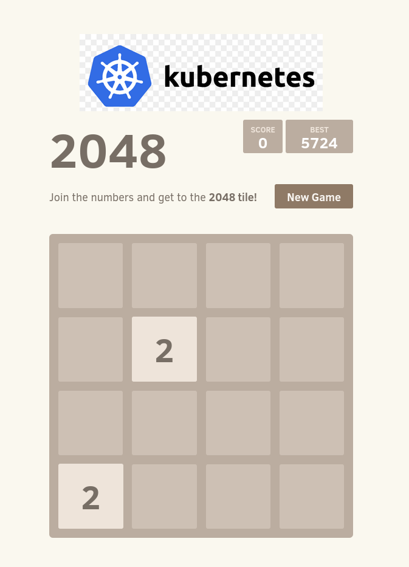
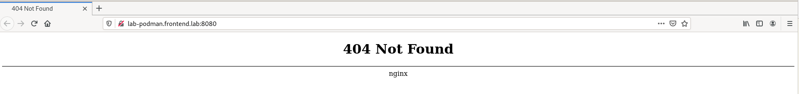
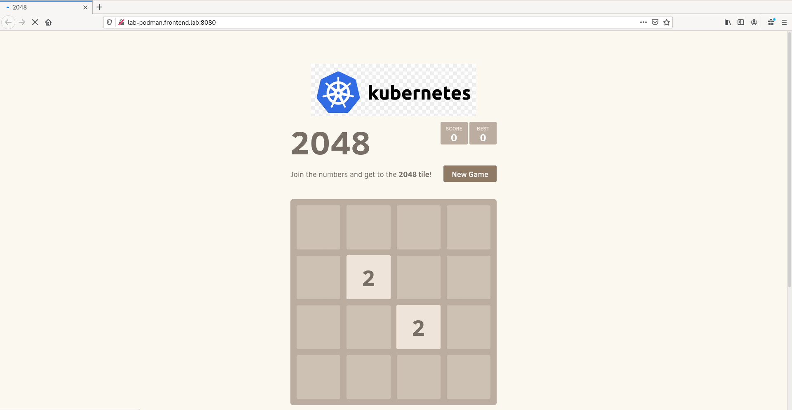
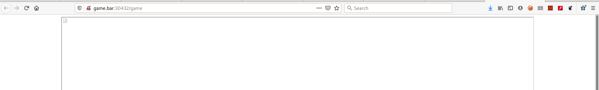
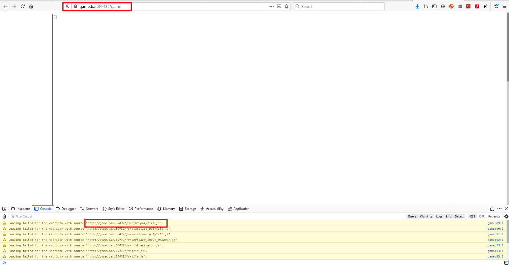
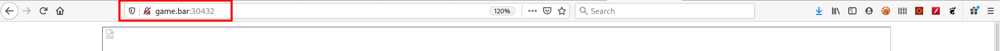
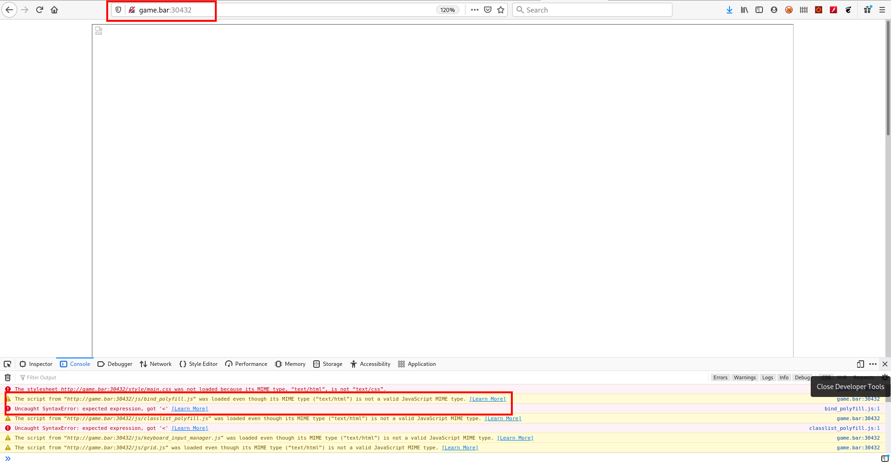
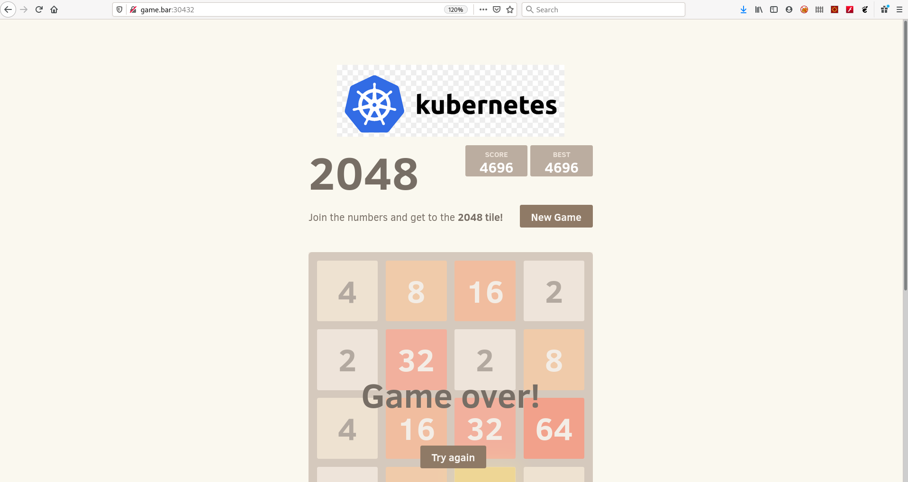

# Instalando una aplicacición más compleja

Hasta ahora hemos visto el despliegue de aplicaciones muy sencillas.

En este apartado vamos a desplegar una aplicación más compleja, modificándola y generando el contenedor para posteriormente desplegarlo en kubernetes.

## Aplicación a instalar

La aplicación que vamos a desplegar es un juego [docker-2048](https://github.com/alexwhen/docker-2048):

<center></center>

Lo primero que vamos a hacer es hacer un fork del repositorio en nuestra cuenta de GitHub.

Clonamos el repositorio en una máquina con podman o docker para construir el contenedor:

```console
[terraform@lab-podman src]$ git clone https://github.com/jadebustos/docker-2048
Cloning into 'docker-2048'...
remote: Enumerating objects: 122, done.
remote: Total 122 (delta 0), reused 0 (delta 0), pack-reused 122
Receiving objects: 100% (122/122), 1.99 MiB | 262.00 KiB/s, done.
Resolving deltas: 100% (37/37), done.
[terraform@lab-podman src]$ cd docker-2048/
[terraform@lab-podman docker-2048]$
```

## Modificando la aplicación

Vamos a añadirle una imágen de tal forma que modificaremos el fichero **2048/index.html** tal que:

<center></center>

Incluyendo la imagen que hayamos elegido en el directorio **2048/meta**.

Es necesario incluir estos cambios en el fichero Dockerfile. El Docker file original:

```dockerfile
FROM alpine:latest

MAINTAINER yourname <your@email> 

RUN apk --update add nginx

COPY 2048 /usr/share/nginx/html

EXPOSE 80

CMD ["nginx", "-g", "daemon off;"]
```

Como se copia todo el contenido del directorio 2048 automáticamente se copian las modificaciones que hemos hecho. Por lo tanto vamos a generar la imagen del contenedor:

```console
[terraform@lab-podman docker-2048]$ buildah bud -t 2048-game .
STEP 1: FROM alpine:latest
...
[terraform@lab-podman docker-2048]$ podman images
REPOSITORY                TAG     IMAGE ID      CREATED         SIZE
localhost/2048-game       latest  fd338acb5eb5  45 seconds ago  9.97 MB
docker.io/library/alpine  latest  e50c909a8df2  4 days ago      5.88 MB
[terraform@lab-podman docker-2048]$ 
```

>  Vamos a utilizar **podman** y **buildah**. Deberías probar a reproducir los pasos con **docker**.

Arrancamos el contenedor:

```console
[terraform@lab-podman docker-2048]$ podman run -d -p 8080:80 localhost/2048-game
15acafbc214b2440b0b4bedf5059182671ab6381bd4e5473cd3c62a88a65a379
[terraform@lab-podman docker-2048]$ podman ps
CONTAINER ID  IMAGE   COMMAND  CREATED  STATUS  PORTS   NAMES
[terraform@lab-podman docker-2048]$ podman ps -a
CONTAINER ID  IMAGE                COMMAND               CREATED        STATUS                    PORTS                 NAMES
15acafbc214b  localhost/2048-game  nginx -g daemon o...  7 seconds ago  Exited (1) 6 seconds ago  0.0.0.0:8080->80/tcp  cool_mestorf
[terraform@lab-podman docker-2048]$ 
```

El contenedor arranca y se para. Debería permanecer arrancado, veamos a ver si en los logs vemos alguna pista que nos indique que pudiera estar pasando:

```console
[terraform@lab-podman docker-2048]$ podman ps -a
CONTAINER ID  IMAGE                COMMAND               CREATED        STATUS                    PORTS                 NAMES
15acafbc214b  localhost/2048-game  nginx -g daemon o...  7 seconds ago  Exited (1) 6 seconds ago  0.0.0.0:8080->80/tcp  cool_mestorf
[terraform@lab-podman docker-2048]$ podman logs 15acafbc214b
nginx: [emerg] open() "/run/nginx/nginx.pid" failed (2: No such file or directory)
[terraform@lab-podman docker-2048]$ 
```

El problema es que no puede crear el fichero de pid para el proceso de nginx. Esto puede ser debido a dos cosas, a que no exista el directorio o a que no tenga permisos de escritura. Ejecutemos una shell en el contenedor:

```console
[terraform@lab-podman docker-2048]$ podman run -it -p 8080:80 localhost/2048-game /bin/ash
/ # ls -lh /run/nginx
ls: /run/nginx: No such file or directory
/ # 
```

>  Existen diferentes shell, las más utilizadas suelen ser **/bin/bash** o **/bin/sh** pero no necesariamente tienen que estar en la imagen del contenedor. En este caso la imagen del contenedor contiene **/bin/ash**.

No existe el directorio donde nginx tiene que crear el fichero para el pid. Por lo tanto vamos a crearlo en el Dockerfile y volvemos a crear la imagen. El Dockerfile quedará:

```dockerfile
FROM alpine:latest

MAINTAINER yourname <your@email> 

RUN apk --update add nginx
RUN mkdir /run/nginx

COPY 2048 /usr/share/nginx/html

EXPOSE 80

CMD ["nginx", "-g", "daemon off;"]
```

Volvemos a construir la imagen del contenedor y lo arrancamos:

```console
[terraform@lab-podman docker-2048]$ buildah bud -t 2048-game .
...
[terraform@lab-podman docker-2048]$ podman run -d -p 8080:80 localhost/2048-game
ac2390cf18ef38c1ce77eed499b6839e623bdcf149251d572b121627ac45d4ac
[terraform@lab-podman docker-2048]$ podman ps
CONTAINER ID  IMAGE   COMMAND  CREATED  STATUS  PORTS   NAMES
ac2390cf18ef  localhost/2048-game  nginx -g daemon o...  18 seconds ago  Up 16 seconds ago  0.0.0.0:8080->80/tcp  silly_jennings
[terraform@lab-podman docker-2048]$ 
```
La imagen del contenedor ya arranca.

Vamos a arrancar un navegador y acceder a la aplicación para comprobar que funciona correctamente:

Nos conectamos con un navegador:

<center></center>

>  Tendrás que abrir el puerto en el firewall para poder acceder:
> ```console 
> [root@lab-podman ~]# firewall-cmd --permanent --add-port=8080/tcp
> success
> [root@lab-podman ~]# firewall-cmd --reload
> success
> [root@lab-podman ~]# 
> ```

Vemos que la aplicación no se muestra, luego hay algún error. Por el Dockerfile vemos que la aplicación se copia al directorio **/usr/share/nginx/html**, vamos a ver si en los logs se muestra algo:

```console
[terraform@lab-podman docker-2048]$ podman ps
CONTAINER ID  IMAGE                COMMAND               CREATED         STATUS             PORTS                 NAMES
ac2390cf18ef  localhost/2048-game  nginx -g daemon o...  14 minutes ago  Up 14 minutes ago  0.0.0.0:8080->80/tcp  silly_jennings
[terraform@lab-podman docker-2048]$ podman logs ac2390cf18ef
[terraform@lab-podman docker-2048]$ 
```

Como no vemos nada nos conectamos al contenedor:

```console
[terraform@lab-podman docker-2048]$ podman exec -it ac2390cf18ef /bin/ash
/ # ps ax
PID   USER     TIME  COMMAND
    1 root      0:00 nginx: master process nginx -g daemon off;
    6 nginx     0:00 nginx: worker process
    7 nginx     0:00 nginx: worker process
    8 root      0:00 /bin/ash
   14 root      0:00 ps ax
/ # ls -lh /usr/share/nginx/
total 4K     
drwxr-xr-x    5 root     root         118 Feb  2 18:46 html
-rw-r--r--    1 root     root         342 Jan  7 22:53 http-default_server.conf
/ # ls -lh /usr/share/nginx/html/
total 20K    
-rw-rw-r--    1 root     root        1.9K Feb  2 16:43 CONTRIBUTING.md
-rw-rw-r--    1 root     root        4.2K Feb  2 16:43 favicon.ico
-rw-rw-r--    1 root     root        4.1K Feb  2 17:05 index.html
drwxrwxr-x    2 root     root         252 Feb  2 16:43 js
drwxrwxr-x    2 root     root         147 Feb  2 17:05 meta
drwxrwxr-x    3 root     root          72 Feb  2 16:43 style
/ #
```

La aplicacion se encuentra en el directorio correcto, **nginx** está arrancado como root y por los permisos sobre los directorios **nginx** puede acceder al contenido sin embargo no está encontrando la aplicación para servirla. Vamos a comprobar la configuración de **nginx**:

```console
/ # nginx -t
nginx: the configuration file /etc/nginx/nginx.conf syntax is ok
nginx: configuration file /etc/nginx/nginx.conf test is successful
/ # nginx -V
nginx version: nginx/1.18.0
built with OpenSSL 1.1.1i  8 Dec 2020
TLS SNI support enabled
configure arguments: --prefix=/var/lib/nginx --sbin-path=/usr/sbin/nginx --modules-path=/usr/lib/nginx/modules --conf-path=/etc/nginx/nginx.conf --pid-path=/run/nginx/nginx.pid --lock-path=/run/nginx/nginx.lock --http-client-body-temp-path=/var/lib/nginx/tmp/client_body --http-proxy-temp-path=/var/lib/nginx/tmp/proxy --http-fastcgi-temp-path=/var/lib/nginx/tmp/fastcgi --http-uwsgi-temp-path=/var/lib/nginx/tmp/uwsgi --http-scgi-temp-path=/var/lib/nginx/tmp/scgi --with-perl_modules_path=/usr/lib/perl5/vendor_perl --user=nginx --group=nginx --with-threads --with-file-aio --with-http_ssl_module --with-http_v2_module --with-http_realip_module --with-http_addition_module --with-http_xslt_module=dynamic --with-http_image_filter_module=dynamic --with-http_geoip_module=dynamic --with-http_sub_module --with-http_dav_module --with-http_flv_module --with-http_mp4_module --with-http_gunzip_module --with-http_gzip_static_module --with-http_auth_request_module --with-http_random_index_module --with-http_secure_link_module --with-http_degradation_module --with-http_slice_module --with-http_stub_status_module --with-http_perl_module=dynamic --with-mail=dynamic --with-mail_ssl_module --with-stream=dynamic --with-stream_ssl_module --with-stream_realip_module --with-stream_geoip_module=dynamic --with-stream_ssl_preread_module --add-dynamic-module=/home/buildozer/aports/main/nginx/src/njs-0.5.0/nginx --add-dynamic-module=/home/buildozer/aports/main/nginx/src/ngx_devel_kit-0.3.1/ --add-dynamic-module=/home/buildozer/aports/main/nginx/src/ngx_brotli-1.0.0rc/ --add-dynamic-module=/home/buildozer/aports/main/nginx/src/ngx_cache_purge-2.5.1/ --add-dynamic-module=/home/buildozer/aports/main/nginx/src/nginx-dav-ext-module-3.0.0/ --add-dynamic-module=/home/buildozer/aports/main/nginx/src/echo-nginx-module-0.62/ --add-dynamic-module=/home/buildozer/aports/main/nginx/src/encrypted-session-nginx-module-0.08/ --add-dynamic-module=/home/buildozer/aports/main/nginx/src/ngx-fancyindex-0.5.1/ --add-dynamic-module=/home/buildozer/aports/main/nginx/src/headers-more-nginx-module-0.33/ --add-dynamic-module=/home/buildozer/aports/main/nginx/src/lua-nginx-module-0.10.19/ --add-dynamic-module=/home/buildozer/aports/main/nginx/src/lua-upstream-nginx-module-0.07/ --add-dynamic-module=/home/buildozer/aports/main/nginx/src/nchan-1.2.7/ --add-dynamic-module=/home/buildozer/aports/main/nginx/src/nginx-http-shibboleth-2.0.1/ --add-dynamic-module=/home/buildozer/aports/main/nginx/src/redis2-nginx-module-0.15/ --add-dynamic-module=/home/buildozer/aports/main/nginx/src/set-misc-nginx-module-0.32/ --add-dynamic-module=/home/buildozer/aports/main/nginx/src/nginx-upload-progress-module-0.9.2/ --add-dynamic-module=/home/buildozer/aports/main/nginx/src/nginx-upstream-fair-0.1.3/ --add-dynamic-module=/home/buildozer/aports/main/nginx/src/nginx-rtmp-module-1.2.1/ --add-dynamic-module=/home/buildozer/aports/main/nginx/src/nginx-vod-module-1.27/ --add-dynamic-module=/home/buildozer/aports/main/nginx/src/ngx_http_geoip2_module-3.3/ --add-dynamic-module=/home/buildozer/aports/main/nginx/src/naxsi-1.3/naxsi_src --add-dynamic-module=/home/buildozer/aports/main/nginx/src/mod_zip-1.2.0/ --add-dynamic-module=/home/buildozer/aports/main/nginx/src/nginx-module-vts-0.1.18/ --add-dynamic-module=/home/buildozer/aports/main/nginx/src/traffic-accounting-nginx-module-2.0/ --add-dynamic-module=/home/buildozer/aports/main/nginx/src/ngx_http_untar_module-1.0/ --add-dynamic-module=/home/buildozer/aports/main/nginx/src/ngx_upstream_jdomain-1.1.5/ --add-dynamic-module=/home/buildozer/aports/main/nginx/src/nginx_cookie_flag_module-1.1.0/ --add-dynamic-module=/home/buildozer/aports/main/nginx/src/array-var-nginx-module-0.05/
/ # ls -lh /var/lib/
total 0      
drwxr-xr-x    2 root     root           6 Jan 28 21:51 apk
drwxr-xr-x    2 root     root           6 Jan 28 21:51 misc
drwxr-x---    4 nginx    nginx         17 Feb  2 18:46 nginx
drwxr-xr-x    2 root     root           6 Jan 28 21:51 udhcpd
/ # ls -lh /var/lib/nginx/
total 0      
drwxr-xr-x    2 root     root          40 Feb  2 18:46 html
lrwxrwxrwx    1 root     root          14 Feb  2 18:46 logs -> /var/log/nginx
lrwxrwxrwx    1 root     root          22 Feb  2 18:46 modules -> /usr/lib/nginx/modules
lrwxrwxrwx    1 root     root          10 Feb  2 18:46 run -> /run/nginx
drwx------    7 nginx    nginx         78 Feb  2 18:46 tmp
/ # 
```

+ Con **nginx -t** vemos que la sintaxis del fichero de configuración es la correcta.

+ Con **nginx -V** vemos la versión y las opciones de configuración.

Si nos fijamos vemos que **--prefix=/var/lib/nginx** esta opción de dice a **nginx** donde buscar las aplicaciones a servir, pero según el Dockerfile la aplicación la hemos copiado a **/usr/share/nginx/html** luego no está encontrando la aplicación.

Ya hemos encontrado dos fallos ¿El Dockerfile es erróneo? La respuesta es no. Si nos vamos al [repositorio de la aplicación](https://github.com/alexwhen/docker-2048) podemos ver que el fichero Dockefile fue modificado por última vez hace seis años. Y si vamos al [repositorio en Docker Hub](https://hub.docker.com/r/alexwhen/docker-2048) podemos ver que la imagen del contenedor publicada tiene también seis años.

Al construir la imagen se construye sobre la imagen **alpine:latest** que, obviamente, en seis años ha ido evolucionando. Entre otras cosas la versión de **ngnix** es diferente y por ese motivo nos hemos encontrado los problemas que hemos tenido.

Deberíamos comprobar la configuración de **nginx** para asegurarnos de que todo está bien, lo que vamos a hacer es incluir nuestro fichero de configuración de **nginx** y vamos a cambiar el directorio donde se copia la aplicación por el que tenemos configurado en la nueva versión de la configuración de **nginx**. El Dockerfile:

```dockerfile
FROM alpine:latest

MAINTAINER yourname <your@email> 

RUN apk --update add nginx
RUN mkdir /run/nginx

COPY 2048 /var/lib/nginx/html
COPY nginx.conf /etc/nginx

EXPOSE 80

CMD ["nginx", "-g", "daemon off;"]
```

El fichero de configuración de **nginx**:

```bash
worker_processes  1;
events {
    worker_connections  1024;
}
http {
    include /etc/nginx/mime.types;
    default_type  application/octet-stream;
    sendfile        on;
    keepalive_timeout  65;
    server {
        listen       80;
        server_name  localhost;
        location / {
            include /etc/nginx/mime.types;
            root   html;
            index  index.html index.htm;
        }
    }
```

Salimos del contenedor, lo destruimos. Creamos la nueva imagen e instanciamos un nuevo contenedor a partir de la imagen nueva:

```console
/ # exit
[terraform@lab-podman docker-2048]$ podman ps
CONTAINER ID  IMAGE                COMMAND               CREATED         STATUS             PORTS                 NAMES
ac2390cf18ef  localhost/2048-game  nginx -g daemon o...  35 minutes ago  Up 35 minutes ago  0.0.0.0:8080->80/tcp  silly_jennings
[terraform@lab-podman docker-2048]$ podman stop ac2390cf18ef
ac2390cf18ef38c1ce77eed499b6839e623bdcf149251d572b121627ac45d4ac
[terraform@lab-podman docker-2048]$ podman rm ac2390cf18ef
ac2390cf18ef38c1ce77eed499b6839e623bdcf149251d572b121627ac45d4ac
[terraform@lab-podman docker-2048]$ buildah bud -t 2048-game .
...
[terraform@lab-podman docker-2048]$ podman run -d -p 8080:80 localhost/2048-game
a097a4469c2342044e1916b8dbe5f743471cf3d2acd98e54220ac90572e41a09
[terraform@lab-podman docker-2048]$ podman ps
CONTAINER ID  IMAGE                COMMAND               CREATED         STATUS            PORTS                 NAMES
a097a4469c23  localhost/2048-game  nginx -g daemon o...  10 seconds ago  Up 9 seconds ago  0.0.0.0:8080->80/tcp  cool_carson
[terraform@lab-podman docker-2048]$ podman logs a097a4469c23
[terraform@lab-podman docker-2048]$ 
```

Nos conectamos con un navegador:

<center></center>

Vemos que la aplicación ya se está ejecutando en el contenedor.

## Subiendo la imagen del contenedor a un repositorio de imágenes

Ahora necesitaremos subir la imagen a un registry. Podemos utilizar [quay.io](https://quay.io) o [Docker Hub](https://hub.docker.com/). Con lo cual será necesario crear una cuenta en uno de estos dos repositorios (o cualquier otro que utilices) y crear un repositorio público llamado **2048-game**.

>  En Noviembre de 2020 Docker cambió la política de descargas con lo cual si realizamos descargas anónimas, sin autenticar, se puede llegar a bloquear la descarga durante un tiempo por exceder el ancho de banda. Mas información [aquí](https://www.docker.com/increase-rate-limits).

Nos autenticamos en el registry que vayamos a utilizar, tageamos la imagen y hacemos push para subirla al repositorio:

```console
[terraform@lab-podman docker-2048]$ podman images
REPOSITORY                TAG     IMAGE ID      CREATED         SIZE
localhost/2048-game       latest  5b926764e9f4  19 minutes ago  9.96 MB
<none>                    <none>  fd338acb5eb5  3 hours ago     9.97 MB
docker.io/library/alpine  latest  e50c909a8df2  4 days ago      5.88 MB
[terraform@lab-podman docker-2048]$ podman login quay.io
Username: rhte_2019
Password: 
Login Succeeded!
[terraform@lab-podman docker-2048]$ podman tag localhost/2048-game quay.io/rhte_2019/2048-game:latest
[terraform@lab-podman docker-2048]$ podman push quay.io/rhte_2019/2048-game:latest
...
[terraform@lab-podman docker-2048]$
```

Vamos a inspeccionar la imagen que hemos subido al repositorio:

```console
[terraform@lab-podman docker-2048]$ skopeo inspect docker://quay.io/rhte_2019/2048-game:latest
{
    "Name": "quay.io/rhte_2019/2048-game",
    "Tag": "latest",
    "Digest": "sha256:4bda9f6bc946ddedb3475d32c23ecaa11198a8a88390cbe5b6818dbc297f6f95",
    "RepoTags": [
        "latest"
    ],
    "Created": "2021-02-02T20:04:27.861187092Z",
    "DockerVersion": "",
    "Labels": {
        "io.buildah.version": "1.16.7"
    },
    "Architecture": "amd64",
    "Os": "linux",
    "Layers": [
        "sha256:083086456ea59f2d6308d4559d99f5d06e5a5a5135ab00c79d82e6cc8c5e8aa9",
        "sha256:a3ed95caeb02ffe68cdd9fd84406680ae93d633cb16422d00e8a7c22955b46d4",
        "sha256:a3ed95caeb02ffe68cdd9fd84406680ae93d633cb16422d00e8a7c22955b46d4",
        "sha256:a3ed95caeb02ffe68cdd9fd84406680ae93d633cb16422d00e8a7c22955b46d4",
        "sha256:a3ed95caeb02ffe68cdd9fd84406680ae93d633cb16422d00e8a7c22955b46d4",
        "sha256:a3ed95caeb02ffe68cdd9fd84406680ae93d633cb16422d00e8a7c22955b46d4",
        "sha256:a3ed95caeb02ffe68cdd9fd84406680ae93d633cb16422d00e8a7c22955b46d4",
        "sha256:a3ed95caeb02ffe68cdd9fd84406680ae93d633cb16422d00e8a7c22955b46d4",
        "sha256:2cced5bacba76414d6fc1b71585320e72847fc4d2ba0473a5e5c6d7b0b15b91c"
    ],
    "Env": [
        "PATH=/usr/local/sbin:/usr/local/bin:/usr/sbin:/usr/bin:/sbin:/bin"
    ]
}
[terraform@lab-podman docker-2048]$ 
```

Como la imagen está funcionando vamos a subir a git los cambios que hemos realizado:

```console
[terraform@lab-podman docker-2048]$ git status
On branch master
Your branch is up to date with 'origin/master'.

Changes not staged for commit:
  (use "git add <file>..." to update what will be committed)
  (use "git restore <file>..." to discard changes in working directory)
	modified:   2048/index.html
	modified:   Dockerfile

Untracked files:
  (use "git add <file>..." to include in what will be committed)
	2048/meta/kubernetes.png
	nginx.conf

no changes added to commit (use "git add" and/or "git commit -a")
[terraform@lab-podman docker-2048]$ git add .
[terraform@lab-podman docker-2048]$ git commit -m "personalización imagen"
[master 1a73fb7] personalización imagen
 Committer: terraform created user <terraform@lab-podman.frontend.lab>
 4 files changed, 23 insertions(+), 1 deletion(-)
 create mode 100644 2048/meta/kubernetes.png
 create mode 100644 nginx.conf
[terraform@lab-podman docker-2048]$ git push
Username for 'https://github.com': jadebustos
Password for 'https://jadebustos@github.com': 
Enumerating objects: 13, done.
Counting objects: 100% (13/13), done.
Delta compression using up to 2 threads
Compressing objects: 100% (8/8), done.
Writing objects: 100% (8/8), 18.34 KiB | 9.17 MiB/s, done.
Total 8 (delta 3), reused 0 (delta 0), pack-reused 0
remote: Resolving deltas: 100% (3/3), completed with 3 local objects.
To https://github.com/jadebustos/docker-2048
   c6795ee..1a73fb7  master -> master
[terraform@lab-podman docker-2048]$ 
```

## Desplegando la imagen en kubernetes

Crearemos un namespace para el despliegue de la aplicación tal y como hemos visto anteriormente:

```console
[kubeadmin@master game]$ kubectl create namespace game
namespace/game created
[kubeadmin@master game]$
```

El fichero para el deployment:

```yaml
apiVersion: apps/v1
kind: Deployment
metadata:
  name: game
  namespace: game
  labels:
    app: game
spec:
  replicas: 1
  selector:
    matchLabels:
      app: game
  template:
    metadata:
      labels:
        app: game
    spec:
      containers:
      - name: game
        image: quay.io/rhte_2019/2048-game:latest
        ports:
        - containerPort: 80
        readinessProbe:
          httpGet:
            path: /
            port: 80
          initialDelaySeconds: 5
          periodSeconds: 5
          successThreshold: 1
```

Como el **nginx** en la imagen que hemos creado arranca en el puerto 80 lo configuramos y también indicamos la imagen que tiene que descargarse [quay.io/rhte_2019/2048-game:latest](quay.io/rhte_2019/2048-game:latest).

Lo siguiente que vamos a crear es el servicio que creará el endpoint donde la aplicación será accesible internamente dentro de kubernetes:

```yaml
apiVersion: v1
kind: Service
metadata:
    name: game-service
    namespace: game
spec:
    selector:
      app: game
    ports:
    - name: http
      protocol: TCP
      port: 80
      targetPort: 80
```

**port** hace referencia al puerto donde escuchará el servicio y **targetPort** indica el puerto donde se encuentra la aplicación dentro del contenedor.

Ahora será necesario crear el ingress de la aplicación que lo que hará es crear una regla en el ingress controller para poder llegar al servicio publicado para acceder al contenedor:

```yaml
apiVersion: networking.k8s.io/v1
kind: Ingress
metadata:
  name: game
  namespace: game
  labels:
    app: game
      annotations:
      haproxy.org/path-rewrite: "/"
spec:
  rules:
  - host: game.bar
    http:
      paths:
      - path: /game
        pathType: "Prefix"
        backend:
          service:
            name: game-service
            port:
              number: 80
```

Donde **number** hace referencia al puerto del servicio.

Creamos la configuración en un ConfigMap:

```yaml
apiVersion: v1
kind: ConfigMap
metadata:
  name: haproxy-configmap
  namespace: game
data:
  servers-increment: "42"
  ssl-redirect: "OFF"
```

Incluimos todo en un único fichero de configuración:

```yaml
apiVersion: apps/v1
kind: Deployment
metadata:
  name: game
  namespace: game
  labels:
    app: game
spec:
  replicas: 1
  selector:
    matchLabels:
      app: game
  template:
    metadata:
      labels:
        app: game
    spec:
      containers:
      - name: game
        image: quay.io/rhte_2019/2048-game:latest
        ports:
        - containerPort: 80
        readinessProbe:
          httpGet:
            path: /
            port: 80
          initialDelaySeconds: 5
          periodSeconds: 5
          successThreshold: 1
---
apiVersion: v1
kind: Service
metadata:
    name: game-service
    namespace: game
spec:
    selector:
      app: game
    ports:
    - name: http
      protocol: TCP
      port: 80
      targetPort: 80
---
apiVersion: networking.k8s.io/v1
kind: Ingress
metadata:
  name: game
  namespace: game
  labels:
    app: game
      annotations:
      haproxy.org/path-rewrite: "/"
spec:
  rules:
  - host: game.bar
    http:
      paths:
      - path: /game
        pathType: "Prefix"
        backend:
          service:
            name: game-service
            port:
              number: 80
---
apiVersion: v1
kind: ConfigMap
metadata:
  name: haproxy-configmap
  namespace: game
data:
  servers-increment: "42"
  ssl-redirect: "OFF"
```

Y hacemos el despliegue:

```console
[kubeadmin@master 2048-game]$ kubectl apply -f game.yaml 
deployment.apps/game created
service/game-service created
ingress.networking.k8s.io/game created
configmap/haproxy-configmap created
[kubeadmin@master 2048-game]$ 
```

Comprobamos el puerto que está exponiendo el Ingress Controller:

```console
[kubeadmin@master 2048-game]$ kubectl get svc --namespace=haproxy-controller
NAME                      TYPE        CLUSTER-IP       EXTERNAL-IP   PORT(S)                                     AGE
haproxy-ingress           NodePort    10.103.225.131   <none>        80:30432/TCP,443:31967/TCP,1024:31588/TCP   8d
ingress-default-backend   ClusterIP   10.96.170.15     <none>        8080/TCP                                    8d
[kubeadmin@master 2048-game]$ kubectl get ingress --namespace=game
NAME   CLASS    HOSTS      ADDRESS   PORTS   AGE
game   <none>   game.bar             80      10m
[kubeadmin@master 2048-game]$ kubectl describe ingress game --namespace=game
Name:             game
Namespace:        game
Address:          
Default backend:  default-http-backend:80 (<error: endpoints "default-http-backend" not found>)
Rules:
  Host        Path  Backends
  ----        ----  --------
  game.bar    
              /game   game-service:80 (192.169.112.36:80)
Annotations:  haproxy.org/path-rewrite: /
Events:       <none>
[kubeadmin@master 2048-game]$ 
```

Luego para acceder a la aplicación lo haremos a través de **http://<span></span>game.bar:30432/game**:

<center></center>

La aplicación no está cargando, abrimos el depurador del navegador a ver que vemos:

<center></center>

Podemos ver que la url a la que estamos accediendo es **http://<span></span>game.bar:30432/game** sin embargo en la pantalla de debug vemos que los elementos que no encuentra los está intentando descargar desde **http://<span></span>game.bar:30432/js/application.js**.

Esto es debido a que en el ingress le hemos especificado que la ruta de la aplicación es **http://<span></span>game.bar:30432/game** pero sin embargo en el código html la ruta que hemos especificado **/game** no se considera.

Para solucionar esto hay varias alternativas:

+ Añadir variables de entorno en el yaml indicando la ruta y hacer que al arrancar el contenedor se modifique el código html para contemplar la ruta. La definición del deployment sería:

  ```yaml
  apiVersion: apps/v1
  kind: Deployment
  metadata:
    name: game
    namespace: game
    labels:
      app: game
  spec:
    replicas: 1
    selector:
      matchLabels:
        app: game
    template:
      metadata:
        labels:
          app: game
      spec:
        containers:
        - name: game
          image: quay.io/rhte_2019/2048-game:latest
          env:
          - name: ROUTE_PATH
            value: "game"
          ports:
          - containerPort: 80
          readinessProbe:
            httpGet:
              path: /
              port: 80
            initialDelaySeconds: 5
            periodSeconds: 5
            successThreshold: 1
  ```
  Luego habría que modificar el código html para que el script de arranque modificará el código html cogiendo el valor de la variable de entorno **ROUTE_PATH**.

+ Eliminar la ruta **/game** en el Ingress. La definición del Ingress de la aplicación sería:

  ```yaml
  apiVersion: networking.k8s.io/v1
  kind: Ingress
  metadata:
    name: game
    namespace: game
    labels:
      app: game
    annotations:
      haproxy.org/path-rewrite: "/"
  spec:
    rules:
    - host: game.bar
      http:
        paths:  
        - path: /
          pathType: "Prefix"
          backend:
            service:
              name: game-service
              port:
                number: 80
  ```

Vamos a utilizar esta última solución. Modificamos el Ingress de la aplicación, borramos el despliegue anterior y lo lanzamos:

```console
[kubeadmin@master 2048-game]$ kubectl delete namespace game
namespace "game" deleted
[kubeadmin@master 2048-game]$ kubectl create namespace game
namespace/game created
[kubeadmin@master 2048-game]$ kubectl apply -f game.yaml 
deployment.apps/game created
service/game-service created
ingress.networking.k8s.io/game created
configmap/haproxy-configmap created
[kubeadmin@master 2048-game]$ 
```

Accedemos con el navegador:

<center></center>

Seguimos teniendo el mismo problema. La aplicación no está cargando, abrimos el depurador del navegador a ver que vemos:

<center></center>

Ahora vemos errores diferentes:

> The script from “http://<span></span>game.bar:30432/js/bind_polyfill.js” was loaded even though its MIME type (“text/html”) is not a valid JavaScript MIME type.
>
> Uncaught SyntaxError: expected expression, got '<'

Parece que no tiene problemas en descargarse el fichero de javasript pero el tipo MIME no es el correcto. Vamos a comprobar el comportamiento atacando al Ingress Controller:

```console
[kubeadmin@master 2048-game]$ curl -I -H 'Host: game.bar' 'http://192.168.1.110:30432/js/bind_polyfill.js'
HTTP/1.1 200 OK
server: nginx/1.18.0
date: Tue, 02 Feb 2021 23:56:22 GMT
content-type: text/html
content-length: 4069
last-modified: Tue, 02 Feb 2021 20:09:38 GMT
etag: "6019b182-fe5"
accept-ranges: bytes

[kubeadmin@master 2048-game]$ 
```

Efectivamente, vemos que se descarga bien, pero el tipo MIME debería ser **application/javascript**.

Vamos a atacar al endpoint interno a ver cual es el resultado:

```console
[kubeadmin@master 2048-game]$ kubectl describe ingress game --namespace=game
Name:             game
Namespace:        game
Address:          
Default backend:  default-http-backend:80 (<error: endpoints "default-http-backend" not found>)
Rules:
  Host        Path  Backends
  ----        ----  --------
  game.bar    
              /   game-service:80 (192.169.112.37:80)
Annotations:  haproxy.org/path-rewrite: /
Events:       <none>
[kubeadmin@master 2048-game]$ curl -I -H 'Host: game.bar' 'http://192.169.112.37:80/js/bind_polyfill.js'
HTTP/1.1 200 OK
Server: nginx/1.18.0
Date: Tue, 02 Feb 2021 23:58:23 GMT
Content-Type: application/javascript
Content-Length: 220
Last-Modified: Tue, 02 Feb 2021 16:43:58 GMT
Connection: keep-alive
ETag: "6019814e-dc"
Accept-Ranges: bytes

[kubeadmin@master 2048-game]$ 
```

Vemos que, sin embargo, desde el enpoint interno el tipo MIME es el correcto. Luego en el Ingress Controller parece que se están resescribiendo las cabeceras.

Vamos a conectarlos al Ingress Controller y ver la configuración para comprobar si hay alguna directiva que reescriba o fuerce las cabeceras:

```console
[kubeadmin@master 2048-game]$ kubectl exec --stdin --tty haproxy-ingress-67f7c8b555-j7qdp --namespace=haproxy-controller -- /bin/sh
/ $ cat /etc/haproxy/haproxy.cfg | grep -i header
  http-request set-header X-Forwarded-Proto https
/ $ cat /etc/haproxy/haproxy.cfg | grep -i mime
/ $ 
```

A priori no las hay. Podemos editar el fichero y revisarlo en detalle.

Si vamos a la definición del ingress de la aplicación:

```yaml
apiVersion: networking.k8s.io/v1
kind: Ingress
metadata:
  name: game
  namespace: game
  labels:
    app: game
  annotations:
    haproxy.org/path-rewrite: "/"
spec:
  rules:
  - host: game.bar
    http:
      paths:
      - path: /
        pathType: "Prefix"
        backend:
          service:
            name: game-service
            port:
              number: 80
```

Vemos que tenemos un rewrite, [path-rewrite](https://www.haproxy.com/documentation/kubernetes/1.4.5/configuration/ingress/), que reescribe la URL. Como es la única reescritura que hemos encontrado vamos a probar a eliminarla y relanzar el despliegue utilizando [game.yaml](2048/-game/game.yaml):

```console
[kubeadmin@master 2048-game]$ kubectl delete namespace game
namespace "game" deleted
[kubeadmin@master 2048-game]$ kubectl create namespace game
namespace/game created
[kubeadmin@master 2048-game]$ kubectl apply -f game.yaml 
deployment.apps/game created
service/game-service created
ingress.networking.k8s.io/game created
configmap/haproxy-configmap created
[kubeadmin@master 2048-game]$ 
```

>  [Annotations](https://kubernetes.io/es/docs/concepts/overview/working-with-objects/annotations/)

>  [Utilizando Annotations en el Ingress Controller](https://www.haproxy.com/documentation/kubernetes/1.4.5/configuration/ingress/)

Ataquemos al Ingress Controller y al enpoint interno a ver si hay cambios:

```console
[kubeadmin@master 2048-game]$ curl -I -H 'Host: game.bar' 'http://192.168.1.110:30432/js/bind_polyfill.js'
HTTP/1.1 200 OK
server: nginx/1.18.0
date: Wed, 03 Feb 2021 00:07:07 GMT
content-type: application/javascript
content-length: 220
last-modified: Tue, 02 Feb 2021 16:43:58 GMT
etag: "6019814e-dc"
accept-ranges: bytes

[kubeadmin@master 2048-game]$ kubectl describe ep game-service --namespace=game
Name:         game-service
Namespace:    game
Labels:       <none>
Annotations:  endpoints.kubernetes.io/last-change-trigger-time: 2021-02-03T00:06:54Z
Subsets:
  Addresses:          192.169.112.38
  NotReadyAddresses:  <none>
  Ports:
    Name  Port  Protocol
    ----  ----  --------
    http  80    TCP

Events:  <none>
[kubeadmin@master 2048-game]$ curl -I -H 'Host: game.bar' 'http://192.169.112.38:80/js/bind_polyfill.js'
HTTP/1.1 200 OK
Server: nginx/1.18.0
Date: Wed, 03 Feb 2021 00:08:51 GMT
Content-Type: application/javascript
Content-Length: 220
Last-Modified: Tue, 02 Feb 2021 16:43:58 GMT
Connection: keep-alive
ETag: "6019814e-dc"
Accept-Ranges: bytes

[kubeadmin@master 2048-game]$ 
```

Esta vez vemos que los tipos MIME si son correctos. Probemos a conectarnos con el navegador:

<center></center>

La aplicación carga correctamente, probamos a jugar unas partidas y vemos que ya funciona correctamente.

## Conclusiones

Hemos desplegado una aplicación a sabiendas de que daría problemas para ilustrar no solo algunos de los problemas que nos podemos encontrar:

+ La imagen base ha cambiado y los cambios generan problemas que hay que depurar.
+ Problemas con la carga de elementos debido a problemas de rutas.
+ Reescritura de cabeceras.

También se ha visto como realizar un troubleshooting según se han ido encontrando los problemas.

