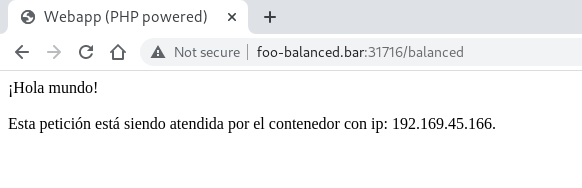
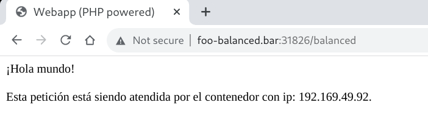
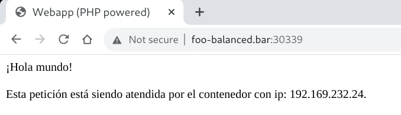
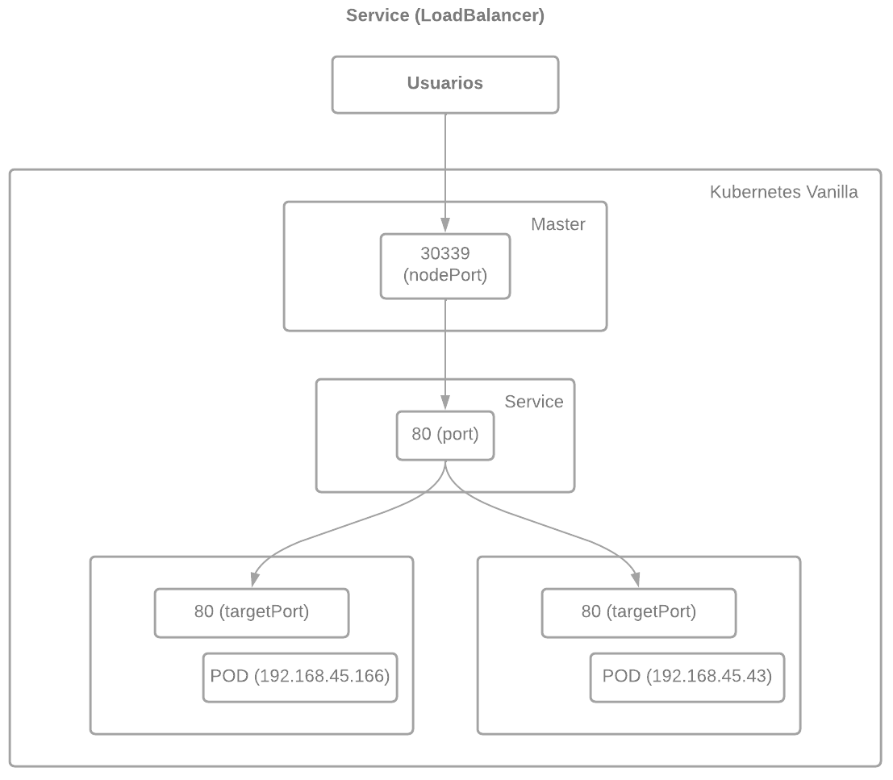
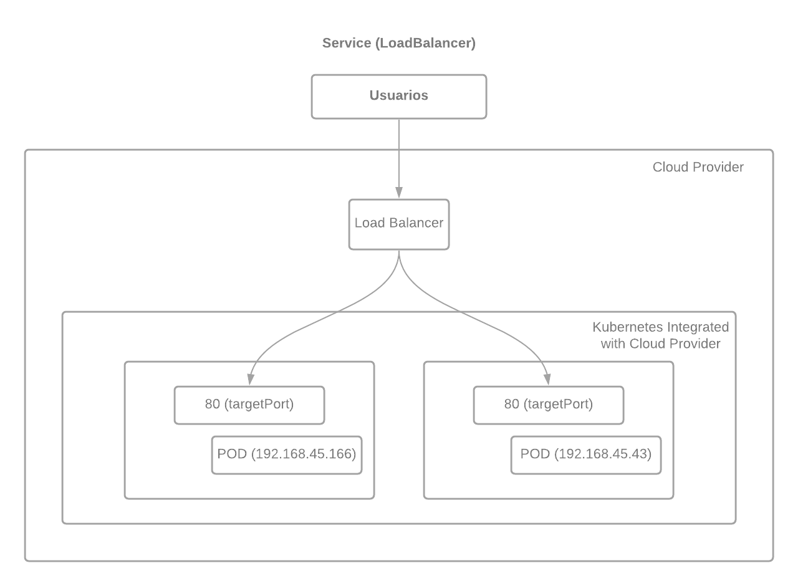
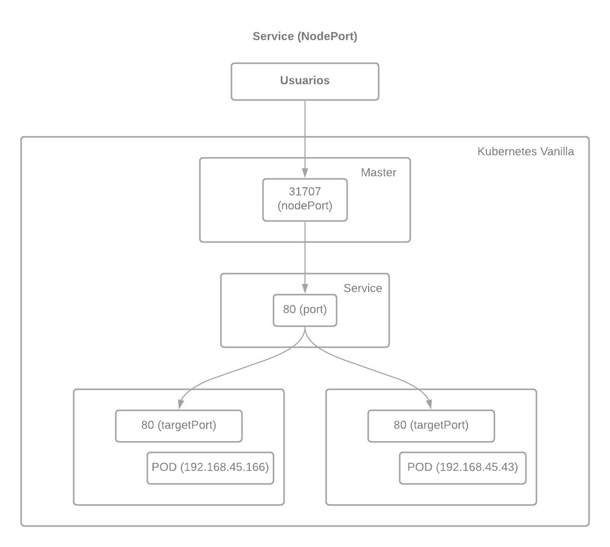
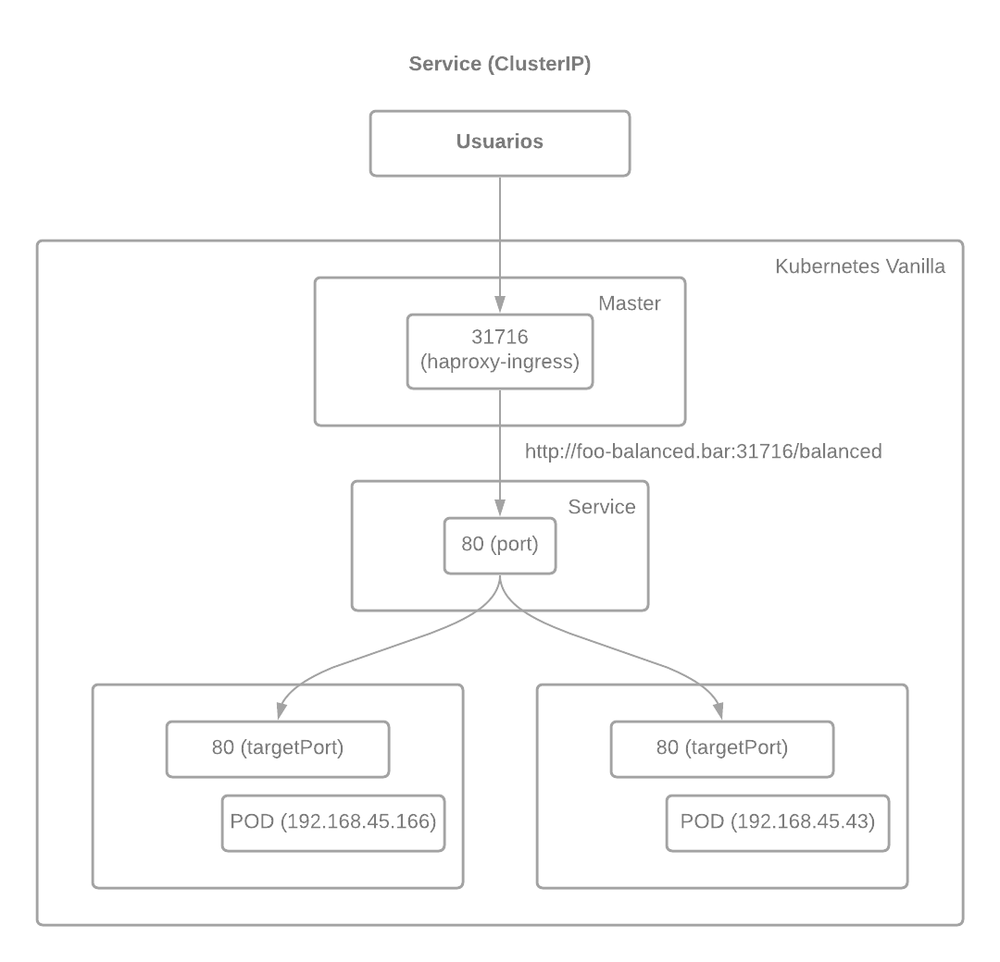

# Desplegando una aplicación balanceada

Desplegaremos una aplicación balanceada.

También entraremos en más detalle sobre como exponer aplicaciones al exterior.

## Namespace

Crearemos el namespace en el que se desplegará la aplicación:

```yaml
kind: Namespace
apiVersion: v1
metadata:
  name: webapp-balanced
  labels:
    name: webapp-balanced
```

## Creación de volúmenes

En el servidor NFS crearemos un share:

```console
[root@kubemaster ~]# cat /etc/exports
/srv/nfs/weblb 192.168.1.160(rw,sync)
/srv/nfs/weblb 192.168.1.161(rw,sync)
/srv/nfs/weblb 192.168.1.162(rw,sync)
[root@kubemaster ~]# exportfs -r
[root@kubemaster ~]#
```

Copiamos el fichero [webapp-balanced](index.php) al share que hemos creado en el servidor NFS. Este fichero será servido por la aplicación balanceada.

## Almacenamiento

Creamos el persistent volume y el claim:

```yaml
apiVersion: v1
kind: PersistentVolume
metadata:
  name: nfs-pv
  namespace: webapp-balanced
spec:
  capacity:
    storage: 10Gi
  volumeMode: Filesystem
  accessModes:
    - ReadWriteMany
  persistentVolumeReclaimPolicy: Recycle
  storageClassName: nfs
  mountOptions:
    - hard
    - nfsvers=4.1
  nfs:
    path: /srv/nfs/weblb
    server: 192.168.1.160
---
apiVersion: v1
kind: PersistentVolumeClaim
metadata:
  name: nfs-pvc
  namespace: webapp-balanced
spec:
  storageClassName: nfs
  accessModes:
    - ReadWriteMany
  resources:
    requests:
      storage: 2Gi
```

## Deployment

Creamos el deployment:

```yaml
apiVersion: apps/v1
kind: Deployment
metadata:
  name: webapp-balanced
  namespace: webapp-balanced
  labels:
    app: webapp-balanced
spec:
  replicas: 1
  selector:
    matchLabels:
      app: webapp-balanced
  template:
    metadata:
      labels:
        app: webapp-balanced
    spec:
      affinity:
        podAntiAffinity:
          requiredDuringSchedulingIgnoredDuringExecution:
          - labelSelector:
              matchExpressions:
              - key: app
                operator: In
                values:
                - webapp-balanced
            topologyKey: "kubernetes.io/hostname"
      containers:
      - name: webapp-balanced
        image: quay.io/rhte_2019/webapp:v1
        ports:
        - containerPort: 80
        readinessProbe:
          httpGet:
            path: /
            port: 80
          initialDelaySeconds: 5
          periodSeconds: 5
          successThreshold: 1
        volumeMounts:
        - name: site-pvc
          mountPath: /var/www/public
      volumes:
      - name: site-pvc
        persistentVolumeClaim:
          claimName: nfs-pvc
```

>  Incluimos una regla de antiafinidad ya que queremos que cada pod se esté ejecutando en un nodo diferente para evitar que si un nodo cae nos quedemos sin servicio.

Inicialmente crearemos una única replica.

## Creamos el servicio balanceado

Creamos el servicio y el ingress tal y como hemos hecho anteriormente. En este caso en el servicio indicaremos que es del tipo **LoadBalancer**:

```yaml
apiVersion: v1
kind: Service
metadata:
    name: balanced-service
    namespace: webapp-balanced
spec:
    selector:
      app: webapp-balanced
    ports:
    - name: http
      protocol: TCP
      port: 80
      targetPort: 80
    type: LoadBalancer
---
apiVersion: v1
kind: Service
metadata:
    name: balanced-service
    namespace: webapp-balanced
spec:
    selector:
      app: webapp-balanced
    ports:
    - name: http
      protocol: TCP
      port: 80
      targetPort: 80
    type: LoadBalancer
---
apiVersion: networking.k8s.io/v1
kind: Ingress
metadata:
  name: balanced-ingress
  namespace: webapp-balanced
  labels:
    app: webapp-balanced
  annotations:
      haproxy.org/path-rewrite: "/"
spec:
  rules:
  - host: foo-balanced.bar
    http:
      paths:
      - path: /balanced
        pathType: "Prefix"
        backend:
          service:
            name: balanced-service
            port:
              number: 80
---
apiVersion: v1
kind: ConfigMap
metadata:
  name: haproxy-configmap
  namespace: webapp-balanced
data:
  servers-increment: "42"
  ssl-redirect: "OFF"
```

>  [Kubernetes Service](https://kubernetes.io/docs/concepts/services-networking/service/)

## Probando la aplicación balanceada

Listamos los pods:

```console
[kubeadmin@kubemaster webapp-balanced]$ kubectl get pods --namespace webapp-balanced -o wide
NAME                               READY   STATUS    RESTARTS   AGE    IP               NODE                  NOMINATED NODE   READINESS GATES
webapp-balanced-6f4f8dcd99-p2vd7   1/1     Running   0          117s   192.169.45.166   kubenode2.jadbp.lab   <none>           <none>
[kubeadmin@kubemaster webapp-balanced]$
```

La ip expuesta para conexiones:

```console
[kubeadmin@kubemaster webapp-balanced]$ kubectl get svc --namespace haproxy-controller
NAME                      TYPE        CLUSTER-IP       EXTERNAL-IP   PORT(S)                                     AGE
haproxy-ingress           NodePort    10.102.13.90     <none>        80:31716/TCP,443:32613/TCP,1024:32192/TCP   11d
ingress-default-backend   ClusterIP   10.110.195.119   <none>        8080/TCP                                    11d
[kubeadmin@kubemaster webapp-balanced]$ 
```

Si nos conectamos a la aplicación:



Si recargamos la página podremos ver que la ip no cambia. Tenemos un único pod sirviendo la aplicación.

Escalamos el deployment para tener dos pods:

```console
[kubeadmin@kubemaster webapp-balanced]$ kubectl scale --replicas=2 deployment/webapp-balanced --namespace=webapp-balanced
deployment.apps/webapp-balanced scaled
[kubeadmin@kubemaster webapp-balanced]$ kubectl get pods --namespace webapp-balanced -o wide
NAME                               READY   STATUS    RESTARTS   AGE     IP               NODE                  NOMINATED NODE   READINESS GATES
webapp-balanced-6f4f8dcd99-b4qpj   1/1     Running   0          20s     192.169.62.43    kubenode1.jadbp.lab   <none>           <none>
webapp-balanced-6f4f8dcd99-p2vd7   1/1     Running   0          8m16s   192.169.45.166   kubenode2.jadbp.lab   <none>           <none>
[kubeadmin@kubemaster webapp-balanced]$
```

Vemos que los pods se están ejecutando en nodos diferentes, tal y como configuramos el deployment con las reglas de antiafinidad. Si recargamos la página del navegador:



Podemos ir recargando y veremos que cada vez que recargamos se muestra una ip diferente. Cada petición la está sirviendo un pod diferente.

## Escalando la aplicación

Escalamos la aplicación para tener tres pods:

```console
[kubeadmin@kubemaster devopslabs]$ kubectl scale --replicas=3 deployment/webapp-balanced --namespace=webapp-balanced
deployment.apps/webapp-balanced scaled
[kubeadmin@kubemaster devopslabs]$ kubectl get pods --namespace webapp-balanced -o wide
NAME                               READY   STATUS    RESTARTS   AGE     IP               NODE                  NOMINATED NODE   READINESS GATES
webapp-balanced-6f4f8dcd99-9pdqs   1/1     Running   0          5m17s   192.169.45.163   kubenode2.jadbp.lab   <none>           <none>
webapp-balanced-6f4f8dcd99-drxfw   0/1     Pending   0          7s      <none>           <none>                <none>           <none>
webapp-balanced-6f4f8dcd99-zfspg   1/1     Running   0          3m11s   192.169.62.38    kubenode1.jadbp.lab   <none>           <none>
[kubeadmin@kubemaster devopslabs]$
```

Vemos que el tercer pod no se ha desplegado. En el clúster tenemos dos nodos y hemos incluido una regla de antiafinidad, por lo tanto no existe ningún nodo en el clúster en el que desplegar el pod:

```console
[kubeadmin@kubemaster devopslabs]$ kubectl get nodes
NAME                   STATUS   ROLES                  AGE   VERSION
kubemaster.jadbp.lab   Ready    control-plane,master   11d   v1.21.1
kubenode1.jadbp.lab    Ready    <none>                 11d   v1.21.1
kubenode2.jadbp.lab    Ready    <none>                 9d    v1.21.1
[kubeadmin@kubemaster devopslabs]$ 
```

Podemos ver los eventos del namespace en el que vemos que no se cumplen las reglas de antiafinidad del deployment:

```console
[kubeadmin@kubemaster devopslabs]$ kubectl get events --namespace webapp-balanced
LAST SEEN   TYPE      REASON              OBJECT                                  MESSAGE
5m49s       Normal    Scheduled           pod/webapp-balanced-6f4f8dcd99-9pdqs    Successfully assigned webapp-balanced/webapp-balanced-6f4f8dcd99-9pdqs to kubenode2.jadbp.lab
5m46s       Normal    Pulled              pod/webapp-balanced-6f4f8dcd99-9pdqs    Container image "quay.io/rhte_2019/webapp:v1" already present on machine
5m45s       Normal    Created             pod/webapp-balanced-6f4f8dcd99-9pdqs    Created container webapp-balanced
5m45s       Normal    Started             pod/webapp-balanced-6f4f8dcd99-9pdqs    Started container webapp-balanced
38s         Warning   FailedScheduling    pod/webapp-balanced-6f4f8dcd99-drxfw    0/3 nodes are available: 1 node(s) had taint {node-role.kubernetes.io/master: }, that the pod didn't tolerate, 2 node(s) didn't match pod affinity/anti-affinity rules, 2 node(s) didn't match pod anti-affinity rules.
36s         Warning   FailedScheduling    pod/webapp-balanced-6f4f8dcd99-drxfw    0/3 nodes are available: 1 node(s) had taint {node-role.kubernetes.io/master: }, that the pod didn't tolerate, 2 node(s) didn't match pod affinity/anti-affinity rules, 2 node(s) didn't match pod anti-affinity rules.
3m43s       Normal    Scheduled           pod/webapp-balanced-6f4f8dcd99-zfspg    Successfully assigned webapp-balanced/webapp-balanced-6f4f8dcd99-zfspg to kubenode1.jadbp.lab
3m41s       Normal    Pulled              pod/webapp-balanced-6f4f8dcd99-zfspg    Container image "quay.io/rhte_2019/webapp:v1" already present on machine
3m41s       Normal    Created             pod/webapp-balanced-6f4f8dcd99-zfspg    Created container webapp-balanced
3m40s       Normal    Started             pod/webapp-balanced-6f4f8dcd99-zfspg    Started container webapp-balanced
5m49s       Normal    SuccessfulCreate    replicaset/webapp-balanced-6f4f8dcd99   Created pod: webapp-balanced-6f4f8dcd99-9pdqs
3m43s       Normal    SuccessfulCreate    replicaset/webapp-balanced-6f4f8dcd99   Created pod: webapp-balanced-6f4f8dcd99-zfspg
39s         Normal    SuccessfulCreate    replicaset/webapp-balanced-6f4f8dcd99   Created pod: webapp-balanced-6f4f8dcd99-drxfw
5m49s       Normal    ScalingReplicaSet   deployment/webapp-balanced              Scaled up replica set webapp-balanced-6f4f8dcd99 to 1
3m43s       Normal    ScalingReplicaSet   deployment/webapp-balanced              Scaled up replica set webapp-balanced-6f4f8dcd99 to 2
39s         Normal    ScalingReplicaSet   deployment/webapp-balanced              Scaled up replica set webapp-balanced-6f4f8dcd99 to 3
[kubeadmin@kubemaster devopslabs]$ 
```

## Explorando el servicio con tipo LoadBalancer

Veamos los datos del servicio que hemos creado:

```console
[kubeadmin@kubemaster webapp-balanced]$ kubectl describe svc balanced-service --namespace webapp-balanced
Name:                     balanced-service
Namespace:                webapp-balanced
Labels:                   <none>
Annotations:              <none>
Selector:                 app=webapp-balanced
Type:                     LoadBalancer
IP Family Policy:         SingleStack
IP Families:              IPv4
IP:                       10.107.139.65
IPs:                      10.107.139.65
Port:                     http  80/TCP
TargetPort:               80/TCP
NodePort:                 http  31707/TCP
Endpoints:                192.169.45.166:80,192.169.62.43:80
Session Affinity:         None
External Traffic Policy:  Cluster
Events:                   <none>
[kubeadmin@kubemaster webapp-balanced]$ kubectl get svc balanced-service --namespace webapp-balanced -o wide
NAME               TYPE           CLUSTER-IP      EXTERNAL-IP   PORT(S)        AGE    SELECTOR
balanced-service   LoadBalancer   10.107.139.65   <pending>     80:30551/TCP   133m   app=webapp-balanced
[kubeadmin@kubemaster network-policies]$
```

Obtengamos la configuración del servicio:

```yaml
[kubeadmin@kubemaster webapp-balanced]$ kubectl get svc balanced-service --namespace webapp-balanced -o yaml
apiVersion: v1
kind: Service
metadata:
  annotations:
    kubectl.kubernetes.io/last-applied-configuration: |
      {"apiVersion":"v1","kind":"Service","metadata":{"annotations":{},"name":"balanced-service","namespace":"webapp-balanced"},"spec":{"ports":[{"name":"http","port":80,"protocol":"TCP","targetPort":80}],"selector":{"app":"webapp-balanced"},"type":"LoadBalancer"}}
  creationTimestamp: "2021-06-20T09:49:09Z"
  name: balanced-service
  namespace: webapp-balanced
  resourceVersion: "138095"
  uid: 938861ad-3f63-40ea-a7e2-52150aa4bd70
spec:
  clusterIP: 10.107.139.65
  clusterIPs:
  - 10.107.139.65
  externalTrafficPolicy: Cluster
  ipFamilies:
  - IPv4
  ipFamilyPolicy: SingleStack
  ports:
  - name: http
    nodePort: 31707
    port: 80
    protocol: TCP
    targetPort: 80
  selector:
    app: webapp-balanced
  sessionAffinity: None
  type: LoadBalancer
status:
  loadBalancer: {}
[kubeadmin@kubemaster webapp-balanced]$
```

Prestemos atención a:

```yaml
  ports:
  - name: http
    nodePort: 31707
    port: 80
    protocol: TCP
    targetPort: 80
  selector:
    app: webapp-balanced
```

+ **nodePort** indica el puerto externo por el que la aplicación se encontrará disponible.
+ **port** indica el puerto expuesto internamente.
+ **targetPort** indica el puerto en el que los contenedores están escuchando.

Se ha expuesto la aplicación por un puerto en el nodo master, 31707:

```console
[kubeadmin@kubemaster webapp-balanced]$ netstat -ln | grep 31707
tcp        0      0 0.0.0.0:31707           0.0.0.0:*               LISTEN     
[kubeadmin@kubemaster webapp-balanced]$
```
Si accedemos a la aplicación por ese puerto:



Si recargamos la página con el navegador veremos que la dirección IP no cambia. Si lo hacemos varias veces terminará cambiando la dirección IP (balanceará al otro contenedor).

Cuando accedemos al servicio por **http://foo-balanced.bar:31716/balanced** estamos accediendo por el ingress, que reenvia la petición al servicio y desde el servicio se balancea a los pods que se encuentren levantados. Sin embargro, cuando accedemos utilizando el nodePort creado al indicar que el servicio es de tipo **LoadBalancer** es decir por la url **http://foo-balanced.bar:31707** estamos accediendo por el balanceador creado.

Luego con esta configuración tenemos dos accesos posibles a la aplicación.

En los siguientes apartados vamos a clarificar esto.

## Acceso por un servicio de tipo LoadBalancer

Hemos especificado que el servicio es de tipo [LoadBalancer](https://kubernetes.io/docs/concepts/services-networking/service/#loadbalancer), este tipo requiere de un balanceador externo proporcionado por un proveedor cloud (**AWS**, **Azure**, **GCP**, ...). Pero no estamos utilizando ningún balanceador externo. ¿Que está pasando?

Un balanceador externo recibirá las peticiones y serán balanceadas a **http://foo-balanced.bar:31707**. Como no tenemos ninguno estamos accediendo directamente al puerto. Cuando despleguemos en un proveedor cloud al crear un servicio de tipo **LoadBalancer** se creará un balanceador que balanceará el tráfico a los pods.

Si utilizamos un servicio de tipo **LoadBalancer** no necesitaremos crear el ingress. En este caso como no hemos desplegado en un cloud provider:



Desplegar en un service provider implica integrar kubernetes con el service provider. Para está integración se desplegará el [Cloud Controller Manager de Kubernetes](https://kubernetes.io/docs/concepts/architecture/cloud-controller/) que permitirá la integración de Kubernetes con el proveedor cloud.

En este caso el desplegar con un servicio de tipo **LoadBalancer** desplegaría un balanceador de carga en el cloud provider y tendríamos algo similar a:



```console
kubectl get svc balanced-service --namespace webapp-balanced -o wide
NAME               TYPE           CLUSTER-IP      EXTERNAL-IP   PORT(S)        AGE    SELECTOR
balanced-service   LoadBalancer   10.107.139.65   <pending>     80:30551/TCP   133m   app=webapp-balanced
[kubeadmin@kubemaster network-policies]$
```

Podemos observar que la **EXTERNAL-IP** se queda en **<pending>**. Ello es debido a que como no se despliega un balanceador al no estar desplegado kubernetes en un proveedor cloud y con integración en el mismo no se desplegará un balanceador.

En este caso para evitar que se cree un NodePort será necesario especificar en el servicio:

```yaml
spec:
  type: LoadBalancer
  allocateLoadBalancerNodePorts: False
  ...
```

>  Redespliega la aplicación eliminando el ingress. Verifica que se realiza el balanceo.

## Acceso por un servicio de tipo NodePort

Con un servicio de tipo [NodePort](https://kubernetes.io/docs/concepts/services-networking/service/#nodeport) no es necesario un ingress. 



>  Redespliega la aplicación eliminando el ingress y configurando el servicio como **NodePort**.

Este tipo de acceso expone un puerto en el master a través del cual será accesible la aplicación:

```console
[kubeadmin@kubemaster webapp-balanced]$ kubectl describe svc balanced-service --namespace webapp-balanced
Name:                     balanced-service
Namespace:                webapp-balanced
Labels:                   <none>
Annotations:              <none>
Selector:                 app=webapp-balanced
Type:                     NodePort
IP Family Policy:         SingleStack
IP Families:              IPv4
IP:                       10.103.138.209
IPs:                      10.103.138.209
Port:                     http  80/TCP
TargetPort:               80/TCP
NodePort:                 http  31183/TCP
Endpoints:                192.169.45.168:80
Session Affinity:         None
External Traffic Policy:  Cluster
Events:                   <none>
[kubeadmin@kubemaster webapp-balanced]$ kubectl get svc balanced-service --namespace webapp-balanced -o yaml
apiVersion: v1
kind: Service
metadata:
  annotations:
    kubectl.kubernetes.io/last-applied-configuration: |
      {"apiVersion":"v1","kind":"Service","metadata":{"annotations":{},"name":"balanced-service","namespace":"webapp-balanced"},"spec":{"ports":[{"name":"http","port":80,"protocol":"TCP","targetPort":80}],"selector":{"app":"webapp-balanced"},"type":"NodePort"}}
  creationTimestamp: "2021-06-20T13:23:50Z"
  name: balanced-service
  namespace: webapp-balanced
  resourceVersion: "173008"
  uid: b593443d-3256-44f7-b8d9-3fcc80f8f06b
spec:
  clusterIP: 10.103.138.209
  clusterIPs:
  - 10.103.138.209
  externalTrafficPolicy: Cluster
  ipFamilies:
  - IPv4
  ipFamilyPolicy: SingleStack
  ports:
  - name: http
    nodePort: 31183
    port: 80
    protocol: TCP
    targetPort: 80
  selector:
    app: webapp-balanced
  sessionAffinity: None
  type: NodePort
status:
  loadBalancer: {}
[kubeadmin@kubemaster webapp-balanced]$
```

Si observamos las salidas anteriores y las comparamos con las del servicio de tipo **LoadBalancer** veremos que son iguales. Es debido a que en ambos casos se está utilizando un **NodePort**. Cuando no utilizamos un balanceador externo, desactivando **NodePort** ambos servicios son equivalentes. Al desactivar **NodePort** y utilizar un balanceador externo se balanceará directamente a los pods.

## Acceso por un servicio de tipo ClusterIP

Cuando hemos creado aplicaciones accesibles desde el exterior hemos utilizado un ingress. Esto es debido a que el tipo por defecto de servicio es de tipo **ClusterIP**, este tipo de servicio es solo accesible desde dentro del cluster y por ese motivo utilizabamos un ingress para enrutar las peticiones hacía el servicio interno.



>  Redespliega la aplicación configurando el servicio como **ClusterIP**. Dado que es el tipo por defecto para el objeto **Service** bastaría con eliminar:
>
>  ```yaml
>    type: NodePort
>  ```

>  Después de desplegar la aplicación y antes de escalarla para tener dos pods conectarese al pod del ingress y revisar la configuración del haproxy para ver como está definido el balanceo al único pod.

>  Escalar la aplicación a dos pods y revisar la configuración del haproxy para ver como está definido el balanceo a los dos pods.

>  En [actividades anteriores](03-desplegando-routed-application.md) ya hemos visto como conectarse al pod del ingress y revisar la configuración del haproxy.

Con este tipo de servicio es necesario un ingress:

```console
[kubeadmin@kubemaster webapp-balanced]$ kubectl describe svc balanced-service --namespace webapp-balanced
Name:              balanced-service
Namespace:         webapp-balanced
Labels:            <none>
Annotations:       <none>
Selector:          app=webapp-balanced
Type:              ClusterIP
IP Family Policy:  SingleStack
IP Families:       IPv4
IP:                10.101.93.25
IPs:               10.101.93.25
Port:              http  80/TCP
TargetPort:        80/TCP
Endpoints:         192.169.45.171:80,192.169.62.47:80
Session Affinity:  None
Events:            <none>
[kubeadmin@kubemaster webapp-balanced]$ kubectl get svc balanced-service --namespace webapp-balanced -o yaml
apiVersion: v1
kind: Service
metadata:
  annotations:
    kubectl.kubernetes.io/last-applied-configuration: |
      {"apiVersion":"v1","kind":"Service","metadata":{"annotations":{},"name":"balanced-service","namespace":"webapp-balanced"},"spec":{"ports":[{"name":"http","port":80,"protocol":"TCP","targetPort":80}],"selector":{"app":"webapp-balanced"}}}
  creationTimestamp: "2021-06-20T13:38:28Z"
  name: balanced-service
  namespace: webapp-balanced
  resourceVersion: "175274"
  uid: 2888ee98-d3ec-42bc-8354-7b0ca0c8ddda
spec:
  clusterIP: 10.101.93.25
  clusterIPs:
  - 10.101.93.25
  ipFamilies:
  - IPv4
  ipFamilyPolicy: SingleStack
  ports:
  - name: http
    port: 80
    protocol: TCP
    targetPort: 80
  selector:
    app: webapp-balanced
  sessionAffinity: None
  type: ClusterIP
status:
  loadBalancer: {}
[kubeadmin@kubemaster webapp-balanced]$
```

Para acceder a la aplicación:

```console
[kubeadmin@kubemaster webapp-balanced]$ kubectl describe ingress balanced-ingress --namespace webapp-balanced
Name:             balanced-ingress
Namespace:        webapp-balanced
Address:          
Default backend:  default-http-backend:80 (<error: endpoints "default-http-backend" not found>)
Rules:
  Host              Path  Backends
  ----              ----  --------
  foo-balanced.bar  
                    /balanced   balanced-service:80 (192.169.45.171:80,192.169.62.47:80)
Annotations:        haproxy.org/path-rewrite: /
Events:             <none>
[kubeadmin@kubemaster webapp-balanced]$ kubectl get svc --namespace haproxy-controller
NAME                      TYPE        CLUSTER-IP       EXTERNAL-IP   PORT(S)                                     AGE
haproxy-ingress           NodePort    10.102.13.90     <none>        80:31716/TCP,443:32613/TCP,1024:32192/TCP   11d
ingress-default-backend   ClusterIP   10.110.195.119   <none>        8080/TCP                                    11d
[kubeadmin@kubemaster webapp-balanced]$
```

lo haremos a través **http://foo-balanced.bar:31716/balanced** y si recargamos la página cada carga será servida por un pod.

Por lo tanto para balancear utilizando un ingress a varios pods no es necesario nada más.

>  Este funcionamiento depende del ingress, con lo cual si utilizamos otro ingress diferente de haproxy el comportamiento podría no ser el mismo.

>  Modificar el fichero [webapp-balanced/webapp-balanced.yaml](webapp-balanced/webapp-balanced.yaml) para que la aplicación sólo se pueda acceder utilizando [TLS](10-desplegando-aplicación-balanceada.md).