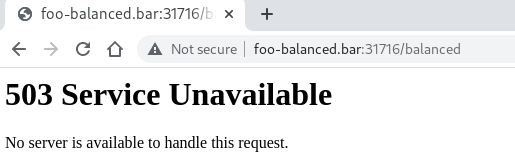

# Network Policies

Por defecto los pods no se encuentran aislados, eso significa que todo el tráfico **ingress** (de entrada) y **egress** (de salida) se encuentra permitido.

El tráfico ingress esta permitido pero únicamente es tráfico interno, para acceder desde el exterior es necesario crear un ingress, exponer un puerto mediante **NodePort**, ...

El tráfico egress es el tráfico saliente. Por defecto está todo el tráfico saliente permitido. Tanto a otros pods/namespaces como hacía fuera del clúster de kubernetes.

## Despliegue de pods

Vamos a desplegar un par de pods, cada uno en un namespace diferente, con utilidades de red para realizar una serie de pruebas:

```console
[kubeadmin@kubemaster network-policies]$ kubectl apply -f utils.yaml 
namespace/utils created
deployment.apps/utils created
[kubeadmin@kubemaster network-policies]$ kubectl apply -f troubleshoot.yaml 
namespace/troubleshoot created
deployment.apps/troubleshoot created
[kubeadmin@kubemaster network-policies]$ kubectl get pod --namespace utils -o wide
NAME                     READY   STATUS    RESTARTS   AGE   IP              NODE                  NOMINATED NODE   READINESS GATES
utils-646c66795d-qdtg9   1/1     Running   1          82m   192.169.62.31   kubenode1.jadbp.lab   <none>           <none>
[kubeadmin@kubemaster network-policies]$ kubectl get pod --namespace troubleshoot -o wide
NAME                            READY   STATUS    RESTARTS   AGE   IP              NODE                  NOMINATED NODE   READINESS GATES
troubleshoot-7bf854b879-v6ggl   1/1     Running   0          14m   192.169.62.32   kubenode1.jadbp.lab   <none>           <none>
[kubeadmin@kubemaster network-policies]$  
```

## Comprobación del tráfico egress

Por defecto todo el tráfico egress está permitido. Realizamos una resolución DNS utilizando el pod que hemos despleado con utilidades de networking:

```console
[kubeadmin@kubemaster network-policies]$ kubectl get pods --namespace utils
NAME                     READY   STATUS    RESTARTS   AGE
utils-646c66795d-qdtg9   1/1     Running   0          30s
[kubeadmin@kubemaster network-policies]$kubectl exec -i -t utils-646c66795d-qdtg9 --namespace utils -- nslookup www.google.com
Server:		10.96.0.10
Address:	10.96.0.10#53

Non-authoritative answer:
Name:	www.google.com
Address: 142.250.201.68

[kubeadmin@kubemaster network-policies]$ kubectl get svc --namespace kube-system
NAME       TYPE        CLUSTER-IP   EXTERNAL-IP   PORT(S)                  AGE
kube-dns   ClusterIP   10.96.0.10   <none>        53/UDP,53/TCP,9153/TCP   12d
[kubeadmin@kubemaster network-policies]$  
```

Vemos que tenemos resolución de DNS y que el servidor que estamos utilizado para las resoluciones DNS es **10.96.0.10**. Este servicio es el proporcionado por **kube-dns**.

Lanzamos un ping a un servidor fuera de kubernetes:

```console
[kubeadmin@kubemaster network-policies]$ kubectl exec -i -t utils-646c66795d-qdtg9 --namespace utils -- ping -c 4 www.google.com
PING www.google.com (142.250.201.68): 56 data bytes
64 bytes from 142.250.201.68: icmp_seq=0 ttl=115 time=10.300 ms
64 bytes from 142.250.201.68: icmp_seq=1 ttl=115 time=13.961 ms
64 bytes from 142.250.201.68: icmp_seq=2 ttl=115 time=12.761 ms
64 bytes from 142.250.201.68: icmp_seq=3 ttl=115 time=10.588 ms
--- www.google.com ping statistics ---
4 packets transmitted, 4 packets received, 0% packet loss
round-trip min/avg/max/stddev = 10.300/11.903/13.961/1.522 ms
[kubeadmin@kubemaster network-policies]$
```

Desplegamos la aplicación balaceada, obtenemos la ip interna de uno de los contenedores, hacemos ping y nos conectamos al puerto 80 del pod en el namespace **webapp-balanced**:

```console
[kubeadmin@kubemaster network-policies]$ kubectl get pod --namespace webapp-balanced -o wide
NAME                               READY   STATUS    RESTARTS   AGE   IP              NODE                  NOMINATED NODE   READINESS GATES
webapp-balanced-6f4f8dcd99-szwdr   1/1     Running   0          14m   192.169.62.30   kubenode1.jadbp.lab   <none>           <none>
[kubeadmin@kubemaster network-policies]$ kubectl exec -i -t utils-646c66795d-qdtg9 --namespace utils -- ping -c 4 192.169.62.30
PING 192.169.62.30 (192.169.62.30): 56 data bytes
64 bytes from 192.169.62.30: icmp_seq=0 ttl=63 time=0.223 ms
64 bytes from 192.169.62.30: icmp_seq=1 ttl=63 time=0.156 ms
64 bytes from 192.169.62.30: icmp_seq=2 ttl=63 time=0.144 ms
64 bytes from 192.169.62.30: icmp_seq=3 ttl=63 time=0.183 ms
--- 192.169.62.30 ping statistics ---
4 packets transmitted, 4 packets received, 0% packet loss
round-trip min/avg/max/stddev = 0.144/0.176/0.223/0.030 ms
[kubeadmin@kubemaster network-policies]$ kubectl exec -i -t troubleshoot-7bf854b879-v6ggl --namespace troubleshoot -- ping -c 4 192.169.62.30
PING 192.169.62.30 (192.169.62.30): 56 data bytes
64 bytes from 192.169.62.30: icmp_seq=0 ttl=63 time=0.238 ms
64 bytes from 192.169.62.30: icmp_seq=1 ttl=63 time=0.169 ms
64 bytes from 192.169.62.30: icmp_seq=2 ttl=63 time=0.164 ms
64 bytes from 192.169.62.30: icmp_seq=3 ttl=63 time=0.196 ms
--- 192.169.62.30 ping statistics ---
4 packets transmitted, 4 packets received, 0% packet loss
round-trip min/avg/max/stddev = 0.164/0.192/0.238/0.029 ms
[kubeadmin@kubemaster network-policies]$ kubectl exec -i -t  utils-646c66795d-qdtg9 --namespace utils  -- nc -zv 192.169.62.30 80
Connection to 192.169.62.30 80 port [tcp/http] succeeded!
[kubeadmin@kubemaster network-policies]$ kubectl exec -i -t troubleshoot-7bf854b879-v6ggl --namespace troubleshoot -- nc -zv 192.169.62.30 80
Connection to 192.169.62.30 80 port [tcp/http] succeeded!
[kubeadmin@kubemaster network-policies]$ 
```

Vemos como desde los dos namespaces, **utils** y **troubleshoot** tenemos ping y conectividad al puerto 80 del pod desplegado en **webapp-balanced**.

## Definiendo ingress Network-Policies

Por defecto todo el tráfico de entrada a un namespace se encuentra permitido. En el momento que definamos una [Network-Policy](https://kubernetes.io/docs/concepts/services-networking/network-policies/) para ese namespace del tipo ingress todo el tráfico de entrada se bloquerá excepto el explicitamente indicado en la política.

Aplicamos la network policy:

```console
[kubeadmin@kubemaster network-policies]$ kubectl apply -f network-policy-ingress-deny-all.yaml 
networkpolicy.networking.k8s.io/default-deny-ingress created
[kubeadmin@kubemaster network-policies]$ kubectl get networkpolicy --namespace webapp-balanced -o yaml
apiVersion: v1
items:
- apiVersion: networking.k8s.io/v1
  kind: NetworkPolicy
  metadata:
    annotations:
      kubectl.kubernetes.io/last-applied-configuration: |
        {"apiVersion":"networking.k8s.io/v1","kind":"NetworkPolicy","metadata":{"annotations":{},"name":"default-deny-ingress","namespace":"webapp-balanced"},"spec":{"podSelector":{},"policyTypes":["Ingress"]}}
    creationTimestamp: "2021-06-20T20:13:09Z"
    generation: 1
    name: default-deny-ingress
    namespace: webapp-balanced
    resourceVersion: "96244"
    uid: abe61532-7d87-4cb8-b1bc-bd5617d7c4fb
  spec:
    podSelector: {}
    policyTypes:
    - Ingress
kind: List
metadata:
  resourceVersion: ""
  selfLink: ""
[kubeadmin@kubemaster network-policies]$ 
```

Y ahora hacemos un ping a cualquiera de los contenedores del namespace donde hemos aplicado la network policy:

```console
[kubeadmin@kubemaster network-policies]$ kubectl get pod --namespace webapp-balanced -o wide
NAME                               READY   STATUS    RESTARTS   AGE   IP              NODE                  NOMINATED NODE   READINESS GATES
webapp-balanced-6f4f8dcd99-szwdr   1/1     Running   0          26m   192.169.62.30   kubenode1.jadbp.lab   <none>           <none>
[kubeadmin@kubemaster network-policies]$ kubectl exec -i -t utils-646c66795d-qdtg9 --namespace utils -- ping -c 4 192.169.62.30
PING 192.169.62.30 (192.169.62.30): 56 data bytes
--- 192.169.62.30 ping statistics ---
4 packets transmitted, 0 packets received, 100% packet loss
command terminated with exit code 1
[kubeadmin@kubemaster network-policies]$ kubectl exec -i -t utils-646c66795d-qdtg9 --namespace utils -- nc -zv 192.169.62.30 80
nc: connect to 192.169.62.30 port 80 (tcp) failed: Connection timed out
command terminated with exit code 1
[kubeadmin@kubemaster network-policies]$
```

>  Si realizamos las mismas operaciones desde el namespace **troubleshoot** obtendremos el mismo resultado.

Como podemos observar no podemos hacer ping ni conectarnos al puerto 80 donde se encuentra escuchando apache en el contenedor. Podemos permitir todo el tráfico entrante ejecutando:

```console
[kubeadmin@kubemaster network-policies]$ kubectl edit networkpolicy default-deny-ingress --namespace webapp-balanced
```

Editaremos la network policy y será necesario editarla de tal forma que quede:

```yaml
# Please edit the object below. Lines beginning with a '#' will be ignored,
# and an empty file will abort the edit. If an error occurs while saving this file will be
# reopened with the relevant failures.
#
apiVersion: networking.k8s.io/v1
kind: NetworkPolicy
metadata:
  annotations:
    kubectl.kubernetes.io/last-applied-configuration: |
      {"apiVersion":"networking.k8s.io/v1","kind":"NetworkPolicy","metadata":{"annotations":{},"name":"default-deny-ingress","namespace":"webapp-balanced"},"spec":{"podSelector":{},"policyTypes":["Ingress"]}}
  creationTimestamp: "2021-06-20T20:13:09Z"
  generation: 2
  name: default-deny-ingress
  namespace: webapp-balanced
  resourceVersion: "97496"
  uid: abe61532-7d87-4cb8-b1bc-bd5617d7c4fb
spec:
  ingress:
  - {}
  podSelector: {}
  policyTypes:
  - Ingress
```

Es decir habremos añadido:

```yaml
  ingress:
  - {}
```

Verificamos la conexión al contenedor:

```console
[kubeadmin@kubemaster network-policies]$ kubectl exec -i -t utils-646c66795d-qdtg9 --namespace utils -- ping -c 4 192.169.62.30
PING 192.169.62.30 (192.169.62.30): 56 data bytes
64 bytes from 192.169.62.30: icmp_seq=0 ttl=63 time=0.262 ms
64 bytes from 192.169.62.30: icmp_seq=1 ttl=63 time=0.159 ms
64 bytes from 192.169.62.30: icmp_seq=2 ttl=63 time=0.156 ms
64 bytes from 192.169.62.30: icmp_seq=3 ttl=63 time=0.154 ms
--- 192.169.62.30 ping statistics ---
4 packets transmitted, 4 packets received, 0% packet loss
round-trip min/avg/max/stddev = 0.154/0.183/0.262/0.046 ms
[kubeadmin@kubemaster network-policies]$ kubectl exec -i -t utils-646c66795d-qdtg9 --namespace utils -- nc -zv 192.169.62.30 80
Connection to 192.169.62.30 80 port [tcp/http] succeeded!
[kubeadmin@kubemaster network-policies]$ 
```

Tenemos comunicación otra vez al contenedor:

>  Si realizamos las mismas operaciones desde el namespace **troubleshoot** obtendremos el mismo resultado.

Editamos la network policy y bloqueamos todo el tráfico tal que:

```yaml
# Please edit the object below. Lines beginning with a '#' will be ignored,
# and an empty file will abort the edit. If an error occurs while saving this file will be
# reopened with the relevant failures.
#
apiVersion: networking.k8s.io/v1
kind: NetworkPolicy
metadata:
  annotations:
    kubectl.kubernetes.io/last-applied-configuration: |
      {"apiVersion":"networking.k8s.io/v1","kind":"NetworkPolicy","metadata":{"annotations":{},"name":"default-deny-ingress","namespace":"webapp-balanced"},"spec":{"podSelector":{},"policyTypes":["Ingress"]}}
  creationTimestamp: "2021-06-20T20:13:09Z"
  generation: 7
  name: default-deny-ingress
  namespace: webapp-balanced
  resourceVersion: "103093"
  uid: abe61532-7d87-4cb8-b1bc-bd5617d7c4fb
spec:
  podSelector: {}
  policyTypes:
  - Ingress
```

Ahora vamos a permitir el tráfico de un namespace específico utilizando las labels con las que hemos etiquetado los pods de dicho namespace **app: utils**:

```yaml
# Please edit the object below. Lines beginning with a '#' will be ignored,
# and an empty file will abort the edit. If an error occurs while saving this file will be
# reopened with the relevant failures.
#
apiVersion: networking.k8s.io/v1
kind: NetworkPolicy
metadata:
  annotations:
    kubectl.kubernetes.io/last-applied-configuration: |
      {"apiVersion":"networking.k8s.io/v1","kind":"NetworkPolicy","metadata":{"annotations":{},"name":"default-deny-ingress","namespace":"webapp-balanced"},"spec":{"podSelector":{},"policyTypes":["Ingress"]}}
  creationTimestamp: "2021-06-20T21:45:15Z"
  generation: 3
  name: default-deny-ingress
  namespace: webapp-balanced
  resourceVersion: "109841"
  uid: 2f16d87a-07b8-498b-9472-4ef436598dca
spec:
  ingress:
  - from:
    - podSelector:
        matchLabels:
          app: utils
  podSelector:
    matchLabels:
      app: webapp-balanced
  policyTypes:
  - Ingress
```

>  La network policy se aplicará a aquellos pods que coincidan con:
>
>  ```yaml
>    podSelector:
>      matchLabels:
>        app: webapp-balanced
>  ```

Verificamos que podemos acceder al puerto 80 y realizar ping al contenedor del namespace **webapp-balanced** desde el namespace **utils**:

```console
[kubeadmin@kubemaster network-policies]$ kubectl exec -i -t utils-646c66795d-qdtg9 --namespace utils -- ping -c 4 192.169.62.30
PING 192.169.62.30 (192.169.62.30): 56 data bytes
64 bytes from 192.169.62.30: icmp_seq=0 ttl=63 time=0.289 ms
64 bytes from 192.169.62.30: icmp_seq=1 ttl=63 time=0.150 ms
64 bytes from 192.169.62.30: icmp_seq=2 ttl=63 time=0.141 ms
64 bytes from 192.169.62.30: icmp_seq=3 ttl=63 time=0.188 ms
--- 192.169.62.30 ping statistics ---
4 packets transmitted, 4 packets received, 0% packet loss
round-trip min/avg/max/stddev = 0.141/0.192/0.289/0.059 ms
[kubeadmin@kubemaster network-policies]$ kubectl exec -i -t utils-646c66795d-qdtg9 --namespace utils -- nc -zv 192.169.62.30 80
Connection to 192.169.62.30 80 port [tcp/http] succeeded!
[kubeadmin@kubemaster network-policies]$ kubectl get deployment --namespace utils -o wide
NAME    READY   UP-TO-DATE   AVAILABLE   AGE   CONTAINERS   IMAGES                 SELECTOR
utils   1/1     1            1           74m   utils        amouat/network-utils   app=utils
[kubeadmin@kubemaster network-policies]$ 
```

Sin embargo desde el namespace **troubleshoot** no tendremos conexión:

```console
[kubeadmin@kubemaster network-policies]$ kubectl exec -i -t troubleshoot-7bf854b879-v6ggl --namespace troubleshoot -- ping -c 4 192.169.62.30
PING 192.169.62.30 (192.169.62.30): 56 data bytes
--- 192.169.62.30 ping statistics ---
4 packets transmitted, 0 packets received, 100% packet loss
command terminated with exit code 1
[kubeadmin@kubemaster network-policies]$ kubectl exec -i -t troubleshoot-7bf854b879-v6ggl --namespace troubleshoot -- nc -zv 192.169.62.30 80
nc: connect to 192.169.62.30 port 80 (tcp) failed: Connection timed out
command terminated with exit code 1
[kubeadmin@kubemaster network-policies]$ kubectl get deployment --namespace troubleshoot -o wide
NAME           READY   UP-TO-DATE   AVAILABLE   AGE    CONTAINERS     IMAGES                 SELECTOR
troubleshoot   1/1     1            1           6m4s   troubleshoot   amouat/network-utils   app=troubleshoot
[kubeadmin@kubemaster network-policies]$ 
```

Como todos los pods del namespace **webapp-balanced** tendrán la misma etiqueta por la forma en la que hemos escrito el deployment podríamos lograr el mismo resultado con la siguiente network policy que utiliza el nombre del namespace como selector:

```console
# Please edit the object below. Lines beginning with a '#' will be ignored,
# and an empty file will abort the edit. If an error occurs while saving this file will be
# reopened with the relevant failures.
#
apiVersion: networking.k8s.io/v1
kind: NetworkPolicy
metadata:
  annotations:
    kubectl.kubernetes.io/last-applied-configuration: |
      {"apiVersion":"networking.k8s.io/v1","kind":"NetworkPolicy","metadata":{"annotations":{},"name":"default-deny-ingress","namespace":"webapp-balanced"},"spec":{"podSelector":{},"policyTypes":["Ingress"]}}
  creationTimestamp: "2021-06-20T22:21:37Z"
  generation: 6
  name: default-deny-ingress
  namespace: webapp-balanced
  resourceVersion: "116290"
  uid: 59b94858-428e-4e16-b1d7-d41e37d45d22
spec:
  ingress:
  - from:
    - namespaceSelector:
        matchLabels:
          name: utils
  podSelector:
    matchLabels:
      app: webapp-balanced
  policyTypes:
  - Ingress
```

>  Utilizando labels podemos aplicar una network policy a aquellos pods que tengan dicha etiqueta, por lo tanto podríamos aplicar la network policy a un subconjunto de pods de un namespace.

Eliminamos la configuración del podSelector de tal forma que se bloquee todo el tráfico entrante:

```yaml
# Please edit the object below. Lines beginning with a '#' will be ignored,
# and an empty file will abort the edit. If an error occurs while saving this file will be
# reopened with the relevant failures.
#
apiVersion: networking.k8s.io/v1
kind: NetworkPolicy
metadata:
  annotations:
    kubectl.kubernetes.io/last-applied-configuration: |
      {"apiVersion":"networking.k8s.io/v1","kind":"NetworkPolicy","metadata":{"annotations":{},"name":"default-deny-ingress","namespace":"webapp-balanced"},"spec":{"podSelector":{},"policyTypes":["Ingress"]}}
  creationTimestamp: "2021-06-20T21:25:36Z"
  generation: 1
  name: default-deny-ingress
  namespace: webapp-balanced
  resourceVersion: "106546"
  uid: b4175cf5-aab4-4438-96c9-0367d2f1d946
spec:
  podSelector: {}
  policyTypes:
  - Ingress
```

Si tenemos definido un ingress observemos que no podemos conectarnos a la aplicación:

```console
[kubeadmin@kubemaster network-policies]$ kubectl get ingress -A
NAMESPACE         NAME               CLASS    HOSTS              ADDRESS   PORTS   AGE
webapp-balanced   balanced-ingress   <none>   foo-balanced.bar             80      100m
[kubeadmin@kubemaster network-policies]$ 
```

Si nos conectamos con un navegador obtendremos un error **503 Service Unavailable**:



Esto es debido a que el tráfico ingress para el namespace está bloqueado, con lo cual no se le permite la entrada al tráfico que entra a través del ingress.

>  Si hemos expuesto la aplicación mediante un servicio **NodePort** o un **LoadBalancer** observaremos que tampoco podremos conectarnos.

Ahora editamos la network policy para permitir el tráfico a los pods etiquetados como **app: utils** tal y como hicimos anteriormente.

Veremos que volvemos a obtener un error **503 Service Unavailable** al intentar acceder con el navegador. Ello es debido a que los pods del ingress no se encuentran etiquetados con **app: utils**.

```console
[kubeadmin@kubemaster network-policies]$ kubectl get ingress --namespace webapp-balanced 
NAME               CLASS    HOSTS              ADDRESS   PORTS   AGE
balanced-ingress   <none>   foo-balanced.bar             80      128m
[kubeadmin@kubemaster network-policies]$ kubectl describe ingress balanced-ingress --namespace webapp-balanced  
Name:             balanced-ingress
Namespace:        webapp-balanced
Address:          
Default backend:  default-http-backend:80 (<error: endpoints "default-http-backend" not found>)
Rules:
  Host              Path  Backends
  ----              ----  --------
  foo-balanced.bar  
                    /balanced   balanced-service:80 (192.169.62.30:80)
Annotations:        haproxy.org/path-rewrite: /
Events:             <none>
[kubeadmin@kubemaster network-policies]$ kubectl get ingress balanced-ingress --namespace webapp-balanced  -o yaml
apiVersion: networking.k8s.io/v1
kind: Ingress
metadata:
  annotations:
    haproxy.org/path-rewrite: /
    kubectl.kubernetes.io/last-applied-configuration: |
      {"apiVersion":"networking.k8s.io/v1","kind":"Ingress","metadata":{"annotations":{"haproxy.org/path-rewrite":"/"},"labels":{"app":"webapp-balanced"},"name":"balanced-ingress","namespace":"webapp-balanced"},"spec":{"rules":[{"host":"foo-balanced.bar","http":{"paths":[{"backend":{"service":{"name":"balanced-service","port":{"number":80}}},"path":"/balanced","pathType":"Prefix"}]}}]}}
  creationTimestamp: "2021-06-20T19:49:23Z"
  generation: 1
  labels:
    app: webapp-balanced
  name: balanced-ingress
  namespace: webapp-balanced
  resourceVersion: "92806"
  uid: cac997a5-6170-44de-84cb-1c9c019ce3f5
spec:
  rules:
  - host: foo-balanced.bar
    http:
      paths:
      - backend:
          service:
            name: balanced-service
            port:
              number: 80
        path: /balanced
        pathType: Prefix
status:
  loadBalancer: {}
[kubeadmin@kubemaster network-policies]$
```