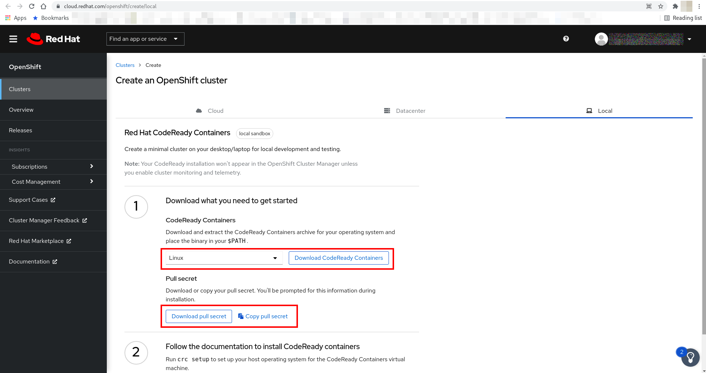

# CodeReady Containers

**CodeReady Containers** o **CRC** es una forma sencilla y rápida de instalar OpenShift en un portatil.

OpenShift requiere de muchos recursos y mediante CRC podemos instalar un all in one en un portatil.

Se requiren como mínimo 9 GB de memoria libre. CRC esta pensado para que los desarrolladores pueden probar en su portatil las aplicaciones. Está soportado en Windows, Linux y Mac.

Obviamente cuanto mas memoria mas fluido irá.

Lo siguiente se basa en la version 1.27 de [Red Hat CodeReady Containers](https://access.redhat.com/documentation/en-us/red_hat_codeready_containers/1.27/html/getting_started_guide/index).

Se puede encontrar la documentación de las versiones de [Red Hat CodeReady Containers en la web de Red Hat](https://access.redhat.com/documentation/en-us/red_hat_codeready_containers/).

## Requisitos.

Se puede descargar desde [la página de developers de Red Hat](https://developers.redhat.com/products/codeready-containers). Se puede crear una cuenta personal y después descargar el [instalador](https://cloud.redhat.com/openshift/create/local) con la cuenta anteriormente creada.

También será necesario descargar **pull-secret** para realizar la instalación:



El instalador creará una máquina virtual y los requisitos mínimos son:

+ 4 virtual cpus (VCPUs).
+ 9 GB de memoria.
+ 35 GB de espacio en disco.

Los sistemas operativos soportados son:

+ Windows 10 Fall Creators Update (versoin 1709) o superior.
+ macOS 10.14 Mojave o superior.
+ RHEL 7.5 o CentOS 7.5 o superiores.
+ Las dos úlimas releases de Fedora (stable).
+ Ubuntu 18.04 LTS o superior.

## Instalación

Una vez descargado el instalador lo descomprimimos:

```console
[jadebustos@beast ~]$ cd crc/
[jadebustos@beast crc]$ cd crc-linux-1.17.0-amd64/
[jadebustos@beast crc-linux-1.17.0-amd64]$ ls
crc  doc.pdf  LICENSE
[jadebustos@beast crc-linux-1.17.0-amd64]$ ./crc setup
INFO Checking if oc binary is cached              
INFO Checking if podman remote binary is cached   
INFO Checking if goodhosts binary is cached       
INFO Checking if CRC bundle is cached in '$HOME/.crc' 
INFO Checking minimum RAM requirements            
INFO Checking if running as non-root              
INFO Checking if Virtualization is enabled        
INFO Checking if KVM is enabled                   
INFO Checking if libvirt is installed             
INFO Checking if user is part of libvirt group    
INFO Checking if libvirt daemon is running        
INFO Checking if a supported libvirt version is installed 
INFO Checking if crc-driver-libvirt is installed  
INFO Checking for obsolete crc-driver-libvirt     
INFO Checking if libvirt 'crc' network is available 
INFO Checking if libvirt 'crc' network is active  
INFO Checking if NetworkManager is installed      
INFO Checking if NetworkManager service is running 
INFO Checking if /etc/NetworkManager/conf.d/crc-nm-dnsmasq.conf exists 
INFO Checking if /etc/NetworkManager/dnsmasq.d/crc.conf exists 
Setup is complete, you can now run 'crc start' to start the OpenShift cluster
[jadebustos@beast crc-linux-1.17.0-amd64]$ 
```

Podemos incrementar la memoria asignada a CRC (en GB):

```console
[jadebustos@beast crc-linux-1.17.0-amd64]$ ./crc config set memory 10240
[jadebustos@beast crc-linux-1.17.0-amd64]$ 
```

Al arrancar CRC deberás introducir el **pull-secret**:

```console
[jadebustos@beast crc-linux-1.17.0-amd64]$ ./crc start -p crc/pull-secret.json 
INFO Checking if oc binary is cached              
INFO Checking if podman remote binary is cached   
INFO Checking if goodhosts binary is cached       
INFO Checking minimum RAM requirements            
INFO Checking if running as non-root              
INFO Checking if Virtualization is enabled        
INFO Checking if KVM is enabled                   
INFO Checking if libvirt is installed             
INFO Checking if user is part of libvirt group    
INFO Checking if libvirt daemon is running        
INFO Checking if a supported libvirt version is installed 
INFO Checking if crc-driver-libvirt is installed  
INFO Checking if libvirt 'crc' network is available 
INFO Checking if libvirt 'crc' network is active  
INFO Checking if NetworkManager is installed      
INFO Checking if NetworkManager service is running 
INFO Checking if /etc/NetworkManager/conf.d/crc-nm-dnsmasq.conf exists 
INFO Checking if /etc/NetworkManager/dnsmasq.d/crc.conf exists 
INFO Loading bundle: crc_libvirt_4.6.1.crcbundle ... 
INFO Checking size of the disk image /home/jadebustos/.crc/cache/crc_libvirt_4.6.1/crc.qcow2 ... 
INFO Creating CodeReady Containers VM for OpenShift 4.6.1... 
INFO CodeReady Containers VM is running           
INFO Generating new SSH Key pair ...              
INFO Updating authorized keys ...                 
INFO Copying kubeconfig file to instance dir ...  
INFO Starting network time synchronization in CodeReady Containers VM 
INFO Check internal and public DNS query ...      
INFO Check DNS query from host ...                
INFO Adding user's pull secret to instance disk... 
INFO Verifying validity of the kubelet certificates ... 
INFO Starting OpenShift kubelet service    
INFO Configuring cluster for first start          
INFO Adding user's pull secret to the cluster ... 
INFO Updating cluster ID ...                      
INFO Starting OpenShift cluster ... [waiting 3m]  
INFO Updating kubeconfig                          
WARN Skipping the kubeconfig update. Cluster operator authentication still not ready after 2min. 
WARN The cluster might report a degraded or error state. This is expected since several operators have been disabled to lower the resource usage. For more information, please consult the documentation 
Started the OpenShift cluster

To access the cluster, first set up your environment by following 'crc oc-env' instructions.
Then you can access it by running 'oc login -u developer -p developer https://api.crc.testing:6443'.
To login as an admin, run 'oc login -u kubeadmin -p Ddbvk-odz4g-NghN8-TiFC8 https://api.crc.testing:6443'.
To access the cluster, first set up your environment by following 'crc oc-env' instructions.

You can now run 'crc console' and use these credentials to access the OpenShift web console.
[jadebustos@beast crc-linux-1.17.0-amd64]$
```

La consola de OpenShift:

```console
[jadebustos@beast crc-linux-1.17.0-amd64]$ crc console --url
https://console-openshift-console.apps-crc.testing
[jadebustos@beast crc-linux-1.17.0-amd64]$ 
```

Las credenciales:

```console
[jadebustos@beast crc-linux-1.17.0-amd64]$ crc console --credentials
To login as a regular user, run 'oc login -u developer -p developer https://api.crc.testing:6443'.
To login as an admin, run 'oc login -u kubeadmin -p Ddbvk-odz4g-NghN8-TiFC8 https://api.crc.testing:6443'
[jadebustos@beast crc-linux-1.17.0-amd64]$ 
```

La ip de CRC:

```console
[jadebustos@beast crc-linux-1.17.0-amd64]$ crc ip
192.168.130.11
[jadebustos@beast crc-linux-1.17.0-amd64]$
```

Será necesario resolver por FQDN, con lo cual podemos incluir en el fichero **/etc/hosts**:

```console
192.168.130.11 api.crc.testing
192.168.130.11 console-openshift-console.apps-crc.testing
```

## Conectándose por SSH a la máquina de CRC

```console
[jadebustos@beast ~]$ ssh -i .crc/machines/crc/id_rsa core@192.168.130.11
Red Hat Enterprise Linux CoreOS 46.82.202010091720-0
  Part of OpenShift 4.6, RHCOS is a Kubernetes native operating system
  managed by the Machine Config Operator (`clusteroperator/machine-config`).

WARNING: Direct SSH access to machines is not recommended; instead,
make configuration changes via `machineconfig` objects:
  https://docs.openshift.com/container-platform/4.6/architecture/architecture-rhcos.html

---
[systemd]
Failed Units: 1
  systemd-modules-load.service
[core@crc-h66l2-master-0 ~]$ 
```

## Eliminando CRC

```
[jadebustos@codeready crc-linux-1.17.0-amd64]$ ./crc stop
INFO Stopping the OpenShift cluster, this may take a few minutes... 
Stopped the OpenShift cluster
[jadebustos@codeready crc-linux-1.17.0-amd64]$ ./crc delete
Do you want to delete the OpenShift cluster? [y/N]: y
Deleted the OpenShift cluster
[jadebustos@codeready crc-linux-1.17.0-amd64]$ ./crc cleanup
INFO Removing the crc VM if exists                
INFO Removing /etc/NetworkManager/dnsmasq.d/crc.conf file 
INFO Will use root access: removing dnsmasq configuration in /etc/NetworkManager/dnsmasq.d/crc.conf 
INFO Will use root access: executing systemctl daemon-reload command 
INFO Will use root access: executing systemctl reload NetworkManager 
INFO Removing /etc/NetworkManager/conf.d/crc-nm-dnsmasq.conf file 
INFO Will use root access: Removing NetworkManager config in /etc/NetworkManager/conf.d/crc-nm-dnsmasq.conf 
INFO Will use root access: executing systemctl daemon-reload command 
INFO Will use root access: executing systemctl reload NetworkManager 
INFO Removing 'crc' network from libvirt          
Cleanup finished
[jadebustos@codeready crc-linux-1.17.0-amd64]$ 
```
